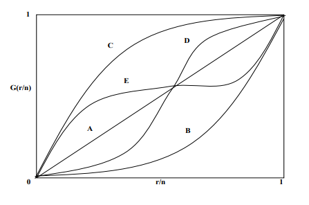

\centering
\raggedright
\begin{center}
```{r pressure, echo=FALSE,out.width = '50%',fig.align='center'}
knitr::include_graphics("unb.jpg")
knitr::opts_chunk$set(echo = FALSE,warning = FALSE, message = FALSE)
```
 \Large Universidade de Brasília\\
 IE - Departamento de Estatística\\
 Análise de Sobrevivência
\end{center} 
 \vskip 12em
\begin{center}
 \Large \textbf{Trabalho Grupo 6} \\ 
        \textbf{Estudo da Política de Autismo nos EUA}
 \par
 \vskip 7em
\end{center}
\setlength{\baselineskip}{.5cm}
\small \textbf{}
\par
\vskip 5em

\begin{flushright}
\small Bruno Henrique Brandão de Souza - 180074695\\
\small Gabriel Peixoto Veiga - 180016946\\
\small Matheus Erbisti Pontes - 180024990\\
\small Rafael Santana Araruna - 180026798\\
\small Ramon Moreira Gonçalves - 180036980\\
\vskip 2em
\small Prof.ª Juliana Betini Fachini Gomes
\end{flushright}

\vskip 6em
\begin{center}
\setlength{\baselineskip}{.5cm}
Brasília\\
\vskip 1em
Outubro de 2021
\end{center}
\newpage
\renewcommand{\contentsname}{Sumário}
\tableofcontents
\newpage

\justify

\fontsize{10pt}{13pt}\selectfont

# Introdução

O Transtorno do Espectro do Autismo (TEA) é uma coleção de distúrbios do neurodesenvolvimento que existem desde o nascimento ou na infância. Segundo a OPAS (Organização Pan-Americana da Saúde), o TEA começa na infância e tende a persistir na adolescência e na idade adulta. Na maioria dos casos, as condições são aparentes durante os primeiros cinco anos de vida. Pessoas com esse tipo de transtorno tendem a apresentar uma dificuldade de socializar e se comunicar com outras pessoas e também a manifestar alguns padrões restritos e repetitivos.

Um estudo nos Estados Unidos detectou uma crescente de casos de TEA em todo o país, fazendo com que os governantes estaduais agissem com políticas públicas para fornecer ajudas e cuidados com as pessoas com TEA.

O objetivo deste trabalho é analisar quanto tempo e quais variáveis influenciam para que um estado leve a adotar a política de autismo de acordo com as características do estado utilizando a Análise de Sobrevivência.

O banco de dados que será utilizado neste estudo tem informações de 48 estados americanos com informações no período entre 1999 e 2017, juntamente com 9 variáveis que representam os atributos dos estados:

```{r}
nome <- c("Nome do Estado", "Ano de Adoção", "Tempo de Falha", "Falha/Censura", "Gov_Dem", "Gov_Rep", "Dif_Dem-Rep (%)", "Ideologia do Cidadão", "Ideologia do Governo","Profissionalismo Legislativo", "População")

descricao <- c("Nome do Estado americano","Ano da adoção da política de autismo","Tempo até a adoção da política de autismo (Tempo inicial é quando o primeiro estado adota a política)","Se o estado adotou a política (1 - adotou/ 0 - não adotou)","Se o governo é democrata (1 - democrata/ 0 - não democrata)","Se o governo é republicano (1 - republicano / 0 - não republicano)","Diferença percentual entre os votos republicanos e democratas nas eleições para Governador do Estado","Medida da ideologia dos cidadãos (0 - Mais Conservador/ 100 - Mais liberal)","Medida da ideologia do Governo do Estado (0 - Mais Conservador/ 100 - Mais liberal)","Medida do profissionalismo legislativo (variável baseada na assembleia de cada estado - número de projetos aprovados, horas trabalhadas, salário dos funcionários, etc.)","População do Estado no ano de aprovação da lei ou no último ano")

table <- data.frame(nome,descricao)

knitr::kable(table, col.names = c("Nome","Descrição"), align = "l")
```


\newpage

# Metodologia

```{r}
banco_autism <- read.csv2("C:/Users/jgararuna/Downloads/Trabalho de Sobrevivência/autism.csv")


names(banco_autism)[1:11] <- c("Nome do Estado", "Ano de Adoção", "Tempo de Falha", "Falha/Censura", "Gov_Dem", "Gov_Rep", "Dif_Dem-Rep (%)", "Ideologia do Cidadão", "Ideologia do Governo","Profissionalismo Legislativo", "População")

sem_na <- banco_autism[complete.cases(banco_autism), ]
sem_na2 <- sem_na
banco_modelo <- banco_autism

require(pacman)
p_load("ggplot2", "usmap", "survival", "knitr", "AdequacyModel", "GGally")
```

## Funções

### Função Densidade de Probabilidade

É definida função densidade de probabilidade como o limite da probabilidade de um indivíduo experimentar o evento de interesse em um intervalo de tempo $[t,t+\Delta t)$ por unidade de $\Delta t$ (comprimento do intervalo), ou por unidade de tempo. *(LEE, 1992)*:


$$f(t) = \lim_{\Delta t \to\  0} \frac{P(t \leq T < t\  +\ \Delta t)}{\Delta t},$$

em que $f(t) \geq \ 0$ para todo $t$ e a área abaixo da curva de $f(t)$ é igual a 1.


### Função de Sobrevivência

A função de sobrevivência é definida como a probabilidade de um indivíduo sobreviver a um tempo t, isso significa que não houve falha do indivíduo até o tempo t. Essa função é apresentada por $S(t)$ e tem sua expressão como:

$$S(t) = P(T \ \geq \ t) = \int_{t}^{\infty} f(x)dx,$$

sendo que $S(t)$ é uma função monótona descrescente e contínua *(LAWLESS, 2003)*. Em conseuqência é definida que a função de distribuição acumulada é a probabilidade de uma observação não sobreviver ao tempo t, isso significa que, $F(t) = 1\ -\ S(t)$.

### Função de Risco ou Taxa de Falha

É definida a função de risco (ou função de taxa de falha) como o limite da probabilidade de um indivíduo falhar no intervalo de tempo $[t,\ \Delta t)$, tendo que este mesmo indivíduo sobreviveu até o tempo $t$, dividida pelo comprimento do intervalo e é representada por *(LAWLESS, 2003)*:


$$h(t) = \lim_{\Delta t \to\  0} \frac{P(t \leq T < t\  +\ \Delta t | T \geq t)}{\Delta t}.$$
Essa expressão também pode ser representada em termos da função de densidade de probabilidade e da função de sobrevivência, isto é:


$$h(t) = \frac{f(t)}{S(t)}.$$


## Estimadores

### Estimador de Kaplan-Meier

O estimador de Kaplan-Meier, também conhecido como **estimador produto**, é definido por:

$$\hat S (t) = \prod_{j:t_j<t} \left( \frac{n_j - d_j}{n_j} \right) = \prod_{j:t_j<t} \left( 1- \frac{d_j}{n_j} \right) $$

sendo,

* $k$ falhas distintas;

* $t_1 < t_2 < \dots < t_k$ os $k$ tempos distintos e ordenados de falha;

* $d_j$ o número de falhas em $t_j, \ j=1, \dots, k$;

* $n_j$ o número de indivíduos sob risco em $t_j$.


As propriedades do estimador de Kaplan-Meier são:

* $\hat S(t)$ é um estimador não viciado;

* $\hat S(t)$ é fracamente consistente;
 
* Kaplan e Meier justificam que a expressão de função densidade de probabilidade é um estimador de máxima verossimilhança de $S(t)$.

O estimador de Kaplan-Meier da função risco acumulado é dado por:

$$\hat H (t) = -[log(\hat S(t))].$$

### Estimador de Nelson-Aalen 

O estimador de Nelson-Aalen é uma alternativa para estimar a função de risco acumulado com a seguinte expressão:

$$\hat H_{NA}(t)= \sum_{j:t_j<t} \left( \frac{d_j}{n_j} \right),$$

sendo,

* $d_j$ é o número de falhas em $t_j$;
* $n_j$ é o número de indivíduos sob risco em $t_j$;
* $j = 1, \dots,k$.


## Testes não-paramétricos

### Teste de *logRank*

* O teste de *logRank* é utilizado particulamente quando a razão das funções de risco dos grupos que serão comparados é constante.

* A suposição de riscos proporcionais pode ser analisada pelo comportamento das curvas de sobrevivência de cada grupo, ao analisar que a razão das funções de risco dos grupos a serem comparados é aproximadamente constante.

As hipóteses para testar as curvas de sobrevivência são iguais são:

$$
\left\{\begin{matrix}
H_0: S_1(t) = S_2(t) \ Não \ existe \ diferença \ entre \ as \ curvas \ de \ sobrevivência\\ 
H_1: S_1(t) \neq S_2(t)\ Existe \ diferença \ entre \ as \ curvas \ de \ sobrevivência
\end{matrix}\right.
$$
Tendo as seguintes quantidades, após a ordenação dos tempos $t_j$ dos dois grupos, chega-se a uma distribuição Hipergeométrica com média $E(d_{1j})$ e variância $V(d_{1j})$:

* $n_j$ representa o número total de indivíduos sob risco em um tempo imediatamente anterior a $t_j$;
* $n_{1j}$ representa o número de indivíduos do grupo 1 sob risco em um tempo imediatamente anterior a $t_j$
* $d_j$ representa o número total de falhas no tempo $t_j$;
* $d_{1j}$ representa o número de falhas do grupo 1 no tempo $t_j$.

$$E(d_{1j}) = d_j \frac{n_{1j}}{n_j}=w_{1j}$$

$$V(d_{1j}) = \frac{n_{1j}d_j(n_j-d_j)(n_j-n_{1j})}{n^2_j(n_j-1)} = V_{1j}$$


A estatística $d_{1j}-w_{1j}$ tem média zero e variância $V_{1j}$. Com isso tem-se a estatística do teste Log-Rank igual a:

$$T = \frac{\left[ \sum^k_{j=1} (d_{1j} - w_{1j}) \right]^2}{\sum^k_{j=1} V_{1j}},$$

e tem aproximadamente distribuição Qui-Quadrado com 1 grau de liberdade.

#### Risco Relativo

Caso haja evidência de desigualdade entre as curvas de sobrevivência dos grupos 1 e 2, juntamente com os riscos de cada função não se cruzarem (riscos proporcionais), então pode-se calcular o Risco Relativo:

$$RR = \frac{O_1/E_1}{O_2/E_2} = \frac{O_1E_2}{E_2O_2}==\frac{(\sum_{j=1}^k d_{1j})(\sum_{j=1}^k(d_j-E_{d_{1j}}))}{(\sum_{j=1}^k E_{d_{1j}})(\sum_{j=1}^k(d_j-d_{1j}))}$$

### Teste de Wilcoxon

Para utilização do teste de Wilcoxon, $u_j = n_j$. Esse teste utiliza peso igual ao número de indivíduos sob risco, coloca mais peso na proporção inicial do eixo do tempo. 

Em casos que não há proporcionalidade dos riscos, o teste de Wilcoxon é mais adequado que o teste de *logRank*.

## Modelos Probabilísticos 

Características da variável aleatória tempo de sobrevivência T:

* Contínua e não negativa;

* Distribuição normal não é adequada para modelar T;

* Na maioria das vezes o tempo de sobrevivência T apresenta forte assimetria.


### Distribuição Weibull

Se a variável T possui uma distribuição *Weibull*, suas funções são representadas por:

* Densidade de probabilidade:

$$f(t) = \frac{\gamma}{\alpha^{\gamma}}t^{\gamma-1} \exp \left \{ - \left( \frac{t}{\alpha} \right)^{\gamma} \right \}, \ t \geq 0,$$
dado que $\gamma > 0$, parâmetro de forma de $\alpha >0$, parâmetro de escala com a mesma unidade de medida de $t$ ;

* Função de Sobrevivência:

$$S(t) = \exp \left \{ - \left( \frac{t}{\alpha} \right)^{\gamma} \right \};$$

* Função Risco:

$$h(t) = \frac{f(t)}{S(t)} = \frac{\gamma}{\alpha^\gamma}t^{\gamma-1},$$

* Parâmetro de forma $\gamma$, determina a forma da função risco:

$\ \ \ \ \ \ \ \ \ \ \ \Rightarrow$ $\gamma < 1$ - função decrescente

$\ \ \ \ \ \ \ \ \ \ \ \Rightarrow$ $\gamma > 1$ - função crescente

$\ \ \ \ \ \ \ \ \ \ \ \Rightarrow$ $\gamma = 1$ - função constante $\to$ distribuição Exponencial


* Média: $E[T] = \alpha \Gamma [1+(1/\gamma)]$;

* Variância: $Var[T] = \alpha^2 \left[ \Gamma[1+(2/\gamma)] - \Gamma[1+(1/\gamma)]^2\right]$, sendo a função gama, $\Gamma(k) = \int^\infty_0 x^{k-1} \exp \{ -x\} dx$

* Percentil $100p\%$,

$$t_p = \alpha[- \log(1-p)]^{1/\gamma}$$

### Distribuição Log-Logística

Se a variável T possui uma distribuição *Log-logística*, suas funções são representadas por:

* Densidade de probabilidade:

$$f(t) = \frac{\gamma}{\alpha^{\gamma}}t^{\gamma-1} (1+(t/\alpha)^\gamma)^{-2},$$
dado que $t > 0$, $\alpha>0$ é o parâmetro de escala e $\gamma >0$ o parâmetro de forma;

* Função de Sobrevivência:

$$S(t) = \frac{1}{1+(t/\alpha)^\gamma};$$

* Função Risco:

$$h(t) = \frac{\gamma(t/\alpha)^{\gamma-1}}{\alpha[1+(t/\alpha)^\gamma]};$$

* Relação entre as distribuições *Log-logística* e *logística*: Se T possui distribuição *Log-logística* com parâmetros $\alpha$ e $\gamma$, então a variável $Y=\log(T)$, tem distribuição logística com parâmetros $-\infty<\mu<\infty$ e $\sigma>0$, em que $\gamma=1/\sigma$ e $\alpha=\exp(\mu)$;

* A função de risco desta distribuição também apresenta formas unimodais $(\gamma>1)$ e decrescente $\gamma \leq 1$;

* Vantagem desta distribuição em relação a distribuição Log-normal: esta apresenta forma analítica explícita para as funções de sobrevivência e risco.


## Gráfico do Tempo Total em Teste (TTT)

O gráfico *TTT* proposto por *Aarset (1987)* tem como objetivo identificar o modelo mais aprorpiado para a variável T, pois existem várias formas que o gráfico da função de taxa de falha dessa variável pode assumir.

A expressão do gráfico em questão é dada por:

$$G(r/n) = \frac{[(\sum^r_{i=1}T_{i:n})+(n-r)T_{r:n}]}{(\sum^n_{i=1}T_{i})},$$

por $r/n$, sendo que $r=1,\dots,n$ e $T_{i:n},\ i=1,\dots,n$ são as estatísticas de ordem da amostra.

```{r, echo=FALSE,out.width = '50%',fig.align='center'}

knitr::opts_chunk$set(echo = FALSE,warning = FALSE, message = FALSE)
```

* Formas da curva $TTT$:

$\ \ \ \ \ \ \ \ \ \ \ \Rightarrow$ reta diagonal (**A**) $\to$ função de taxa de falha constante é adequada;

$\ \ \ \ \ \ \ \ \ \Rightarrow$ curva convexa (**B**) ou côncava(**C**) $\to$ função taxa de falha é monotonicamente decrescente ou crescente, respectivamente;

$\ \ \ \ \ \ \ \ \ \ \ \Rightarrow$ curva convexa e depois côncava (**D**) $\to$  função taxa de falha tem forma de **U**;

$\ \ \ \ \ \ \ \ \ \ \ \Rightarrow$ curva côncava e depois convexa (**E**) $\to$  função taxa de falha é unimodal.


\subsection {Gráfico de $\hat{H}{(t)}$ }

* Uma alternativa ao gráfico $TTT$ é construir o gráfico da função de risco acumulada estimada, $\hat{H}(t)$;

* $\hat{H}(t)$ pode ser encontrada por meio dos estimadores de Kaplan-Meier e Nelson-Aalen;

* Esse gráfico é mais indicado do que o gráfico $TTT$ em situações que o número de censuras é grande.

* Formas $\hat{H}(t)$:

$\ \ \ \ \ \ \ \ \ \ \Rightarrow$ reta diagonal (não necessariamente a reta $y=x$) (**A**) $\to$ função de taxa de falha constante é adequada;

$\ \ \ \ \ \ \ \ \Rightarrow$ curva convexa (**B**) ou côncava(**C**) $\to$ função taxa de falha é monotonicamente crescente ou decrescente, respectivamente;

$\ \ \ \ \ \ \ \ \ \ \ \Rightarrow$ curva convexa e depois côncava (**D**) $\to$  função taxa de falha é unimodal;

$\ \ \ \ \ \ \ \ \ \ \ \Rightarrow$ curva côncava e depois convexa (**E**) $\to$  função taxa de falha tem forma de **U**.

* **Obs:** a interpretação de $\hat{H}{(t)}$ é o inversa da curva $TTT$.

## Teste da Razão de Verossimilhanças

* Tendo a hipótese nula - $H_0\ : \ \theta=\theta_0$,

* A estatística do teste é dada por:

$$TRV = -2\log \left[ \frac{L(\hat{\theta_0})}{L(\hat\theta)} \right]=2[\log L(\hat\theta)-\log L(\hat{\theta_0})],$$

que sob $H_0$, tem distribuição aproximadamente qui-quadrado com $p$ graus de liberdade. Para amostras grandes, $H_0$ é rejeitada, a um nível de 100% de significância, se $TRV>\chi^2_{p,1-\alpha}$.

## Medidas para classificação e seleção do modelo:

### Critério de Akaike - AIC

$$AIC = -2 \log(L(\hat{\theta})) + 2p,$$

Sendo $p$ o número de parâmetros estimados no modelo.


* Modelo esolhido deve ter o menor valor do $AIC$ dentre todos os modelos testados;

* Para *Burnham e Anderson (2002)* a recomendação do uso do $AIC$ é apenas quando $n/p \geq 40$ 


### Critério de Akaike corrigido - AICc

$$AICc = AIC\  + \ \frac{2p(p+1)}{n-p-1},$$

* Para pequenas amostras, $n/p < 40$

* Modelo escolhido deve ter o menor valor de $AICc$ dentre todos os modelos testados.

### Critério de Informação Bayesiano - BIC

$$BIC = -2\log(L(\hat\theta))\ +\ p \ * \ \log(n)$$

* Modelo escolhido deve ter o menor valor de $BIC$ dentre todos os modelos testados.

* O critério $BIC$ penaliza mais modelos com maior número de parâmetros do que o critério $AIC$. Com isso, a selecionar modelos com um número menor de parâmetros.

## Discretização dos Modelos 

### Distribuição Weibull Discreta

* Seja $X$ uma variável aleatória contínua com distribuição de probabilidade e sua respectiva função de distribuição acumulada é dada por:

$$F(x) =1- \exp \left \{ - \left( \frac{x}{\alpha} \right)^{\gamma} \right \};$$

* A distribuição de probabilidade da variável aleatória discreta T, pode ser escrita como:

$$p_{wd}(t) = P(T=t)$$

$$ p_{wd}(t)=\left[ 1-\exp \left \{ - \left( \frac{t+1}{\alpha} \right)^{\gamma} \right \} \right] - \left[ 1-\exp \left \{ - \left( \frac{t}{\alpha} \right)^{\gamma} \right \} \right]$$

$$p_{wd}(t) =q^{t^{\gamma}}-q^{(t+1)^{\gamma}}, \ \ t=0,1,2,\dots$$

em que $\exp \frac{-1}{\alpha^\gamma}, \ 0<q<1$ e $\gamma$ é o parâmetro de forma da distribuição.

* A função de sobrevivência e a função distribuição acumulada da Weibull Discreta (WD) são definidas por:

$$S_{wd}(t) = \sum^{\infty}_{k=t+1}P(T=k)$$

$$S_{wd}(t) = \sum^{\infty}_{k=t+1}(q^{t^\gamma}- q^{(t+1)^{\gamma}})$$

$$S_{wd}(t) = q^{(t+1)^\gamma}, \ \ t=0,1,2,\dots$$

e

$$F_{wd}(t) = 1-q^{{(t+1)}^\gamma}, \ \ t=0,1,2,\dots$$

* A função de risco associada a distribuição Weibull Discreta é definida por:

$$h_{wd}(t)= \frac{q^{t^\gamma}-q^{{(t+1)}^\gamma}}{q^{t^{\gamma}}}, \ \ t=0,1,2,\dots$$

* Para diferentes valores do parâmetro $\gamma$, tem-se que:

$\ \ \ \ \ \ \ \ \ \ \ \Rightarrow$ $\gamma > 1$, a taxa de falha é estritamente crescente;

$\ \ \ \ \ \ \ \ \ \ \ \Rightarrow$ $\gamma = 1$, a taxa de falha é constante (a distribuição WD se reduz a distribuição Geométrica);

$\ \ \ \ \ \ \ \ \ \ \ \Rightarrow$ $\gamma < 1$, a taxa de falha é estritamente decrescente.

### Distribuição Log-Logística Discreta

* Seja X uma variável aleatória contínua com distribuição de probabilidade Log-logística e sua respectiva função de distribuição acumulada é dada por:

$$F(x)=1-\frac{1}{1+(x/\alpha)^\gamma}$$

* A distribuição de probabilidade da variável aleatória discreta T, pode ser escrita como:

$$p_{llog}(t) = P(T=t)$$

$$ p_{llog}(t)=\left[ 1- \frac{1}{1+((t+1)/\alpha)^\gamma} \right] - \left[ 1- \frac{1}{1+(t/\alpha)^\gamma} \right]$$

$$p_{llog}(t) = \frac{1}{1+(t/\alpha)^\gamma } - \frac{1}{1+((t+1)/\alpha)^\gamma}, \ \ t=0,1,2,\dots$$

em que $t>0, \alpha>0$ é o parâmetro de escala e $\gamma>0$ é o parâmetro de forma.

* A função de sobrevivência e a função distribuição acumulada da distribuição Log-logística Discreta são definidas por:

$$S_{llog}(t) = \sum^{\infty}_{k=t+1}P(T=k)$$

$$S_{llog}(t) = \sum^{\infty}_{k=t+1} \left[ \frac{1}{1+(t/\alpha)^\gamma } - \frac{1}{1+((t+1)/\alpha)^\gamma} \right]$$

$$S_{llog}(t) = \frac{1}{1+((t+1)/\alpha)^\gamma}, \ \ t=0,1,2,\dots$$

e

$$F_{llog}(t) = 1- \frac{1}{1+((t+1)/\alpha)^\gamma}, \ \ t=0,1,2,\dots$$

* A função de risco associada a distribuição Log-Logística Discreta:

$$h_{llog}(t) = 1- \frac{1+(t/\alpha)^\gamma}{1+((t+1)/\alpha)^\gamma}, \ \ t=0,1,2,\dots$$

* A função de risco desta distribuição apresenta formas unimodais $(\gamma>1)$ e decrescente $(\gamma \leq 1)$.

## Análise de resíduos

* Resíduo de Cox-Snell

$$\hat e_i = \hat H(t_i|x_i)\ ou \ \hat e_i = \hat H(y_i|x_i)$$

em que $\hat H(.)$ é a função de risco acumulado obtida do modelo ajustado.

* Resíduo Martingal

Inicialmente, os resíduos martigal foram introduzidos nos processos de contagem, depois reescritos para modelos de regressão paramétricos na presença de dados censurados com a seguinte forma:

$$\hat r_{M_i} = \delta_i - \hat H(t_i|x_i) \ ou \ \hat r_{M_i} = \delta_i - \hat H(y_i|x_i),$$

em que $\delta_i$ é a variável indicadora de falha e $\hat H(t_i|x_i)$ ou $\hat H(y_i|x_i)$ é a função de risco acumulada obtida do modelo ajustado, também conhecida como resíduos de Cox-Snell.

* Resíduos Deviance

Para os modelos de regressão paramétricos, os resíduos deviance são definidos por:

$$\hat r_{D_i} = sinal(\hat r_{M_i}) \left[ -2 \left( \hat r_{M_i} + \delta_i \log(\delta_i - \hat r_{M_i}) \right) \right]^{1/2}$$

## Modelo de Regressão de Cox

* Assumindo proporcionalidade entre essas funções de risco, temos que:

$$\frac{h_1(t)}{h_0(t)}=k,$$

em que $k>0$ é a razão das taxas de falha constante para todo tempo $t$ de acompanhamento do estudo;

* Seja $x$ a variável indicadora de um grupo e $k = \exp(\beta x)$, então:

$$\frac{h_1(t)}{h_0(t)}=\exp(\beta x)$$

e

$h_1(t) = h_0(t)\exp (\beta x)$

* A expressão geral do modelo de Cox é expressa por:

$$h(t|x) = h_0(t)g(x^T \beta),$$

em que $h_0(t)$ é uma função não negativa no tempo e não especificada (componente não paramétrico) e $\beta$ é o vetor de parâmetros associado as covariáveis.

* E pelo componente paramétrico:

$$g(x^T \beta) = \exp(x^T \beta) = \exp(\beta_1 x_1+\beta_2 x_2+ \dots+\beta_p x_p),$$

em que $\beta$ é o valor de parâmetros associado as covariáveis.

* O modelo de riscos proporcionais usual de Cox é dado por:

$$h(t|x) = h_0 \exp(x^T \beta),$$

em que $h_0(t)$ é uma função não negativa no tempo e não especificada (componente não paramétrico) e $\beta$ é o vetor de parâmetros associado as covariáveis.

* A razão de taxa de falha para os indivíduos $i \neq j$ é dada por:

$$\frac{h(t|x_i)}{h(t|x_j)} = \frac{h_0(t) \exp(x_i^T \beta)}{h_0(t) \exp(x_j^T \beta)} = \exp (x_i^T \beta - x_j^T \beta),$$

e não depende do tempo.

* Função de sobrevivência associada ao modelo de Cox é definida por:

$$S(t|x) = [S_0(t)^{\exp(x^T \beta)}]$$

* Conhecendo $S(t|x)$ e $h(t|x)$ do modelo, podemos pensar no método de máxima verossimilhança para estimar os parâmetros do modelo. Dessa forma, temos que:

$$L(\beta) = \prod^n_{i=1}[h_0(t_i) \exp(x_i^T \beta)]^{\delta_i}[S_0(t_i)]^{\exp(x_i^T \beta)},$$

que depende do componente não paramétrico $h_0(t)$.

* A função de verossimilhança parcial é formada pelo produto de todos os termos representados por:

$\ \ \ \ \ \ \ \ \ \ \ \Rightarrow$ Para construir a função de verossimilhança parcial considere uma amostra de $n$ indivíduos em que $k \leq n$ falhas distintas ocorram nos tempos $t_1<t_2< \dots<t_k;$

$\ \ \ \ \ \ \ \ \ \ \ \Rightarrow$ E a probabilidade condicional da *i-ésima* observação vir a falhar no tempo $t_i$ conhecendo quais observações estão sob risco em $t_i$ é:

$$P[indivíduo \ falhar \ em \ t_i|uma \ falha \ em \ t_i \ e \ história \ em \ t_i] = \frac{\exp(x_i^T \beta)}{\sum_{j \in R(t_i)} \exp(x_j^T \beta)}$$

associados aos tempos distintos de falha, isto é:

$$L(\beta)= \prod^k_{i=1}\frac{\exp(x_i^T \beta)}{\sum_{j \in R(t_i)} \exp(x_j^T \beta)} = \prod^k_{i=1} \left[ \frac{\exp(x_i^T \beta)}{\sum_{j \in R(t_i)} \exp(x_j^T \beta)} \right]^{\delta_i}$$

em que $R(t_i)$ o conjunto dos índices das observações sob risco no tempo $t_i$ e $\delta_i$ é o indicador de falhas e censuras.

* A verossimilhança parcial modificada por *Breslow (1972)* e *Peto(1972)* é expressa por:

$$L(\beta) = \prod^k_{i=1}\frac{\exp(s_i^T \beta)}{[\sum_{j \in R(t_i)} \exp(x_j^T \beta)]^{d_i}}$$

\subsection{Estimando as funções de base: $h_0(t)$ e $S_0(t)$}

Uma estimativa não paramétrica para $H_0(t)$, proposta por *Beslow(1972)*, é uma função escada com saltos nos tempos distintos de falha e expresso por:

$$\hat H_0(t) = \sum_{j:t_j<t} \frac{d_j}{\sum_{I \in R_J} \exp(x_I^T \hat \beta)},$$

em que $d_j$ é o número de falhas em $t_j$. Consequentemente, encontramos $\hat{S_0}(t)$ e $\hat{S}(t)$, que são funções escadas decrescentes com o tempo, dadas respectivamente por:

$$\hat{S_0}(t)= \exp\{-\hat{H_0}(t) \},$$

e

$$\hat{S}(t) = [\hat{S_0}(t)]^{\exp \{ x^T \hat \beta \}}$$

Na ausência de covariáveis, $\hat H_0(t)$ se reduz a:

$$\hat H_0(t) = \sum_{j: t_j<t} \frac{d_j}{n_j},$$

que é o estimador de *Nelson-Aalen* descrito na modelagem não-paramétrica. Por esse fato, o estimador proposto por *Breslow(1972)* expresso em $\hat H_0(t) = \sum_{j:t_j<t} \frac{d_j}{\sum_{I \in R_J} \exp(x_I^T \hat \beta)}$ é também conhecido como estimador de *Nelson-Aalen-Breslow*.

## Adequação do Modelo de Cox

\subsubsection{Avaliação da suposição de riscos proporcionais}

* Método gráfico descritivo

* Resíduos de Schoenfeld (1982)

Considere que o *i-ésimo* indivíduo com vetor de covariáveis $x_i = (x_{1i},x_{2i},\dots,x_{pi})^T$ é observado falhar, tem-se para este indivíduo um vetor de resíduos de Schoenfeld $r_i = (r_{i1},r_{i2},\dots,r_{ip})$ em que cada componente $r_{iq}$, para $q = 1,2,\dots,p$, é definido por:

$$r_{iq} = x_{iq} - \frac{\sum_{j \in R(t_i)}x_{jq} \exp(x_j^T \hat \beta)}{\sum_{j \in R(t_i)}\exp(x_j^T \hat \beta)}$$

Para permitir que a estrutura de correlação dos resíduos seja considerada, uma forma padronizada dos resíduos de Schoenfeld é frequentemente usada e é definida por:

$$s^*_i=[I(\hat \beta)]^{-1} x \ r_i$$

em que $I(\hat \beta)$ a matriz de informação observada.

* Grambsch e Therneau (1994):

$$h(t) = h_0(t) \exp \{ x^T \beta(t)\},$$

com restrição de que $\beta(t) = \beta$, como uma forma alternativa de representar o modelo de Cox.

* Teste de Hipótese

Estatística do teste para hipótese geral (ou global) de proporcionalidade dos riscos sobre todas as covariáveis no modelo, assumindo $g_q(t) = g(t)$:

$$T = \frac{(g- \bar g)^T S^* IS^* (g- \bar g)}{d \sum_k (g_k - \bar g)^2},$$

em que $I$ é a matriz de informação observada, $d$ é o número de falhas e $S^* = dRI^{-1}$, sendo R a matriz $d$ x $p$ dos resíduos de Schoenfeld não padronizados.

Sob a hipótese nula de proporcionalidade dos riscos, $T$ tem distribuição qui-quadrado com $p$ graus de liberdade. Valores de $T> \chi^2_{p, 1-\alpha}$ mostram evidências contra a suposição de riscos proporcionais.

Estatística do teste para hipótese de riscos proporcionais para a *q-ésima* covariável, $q=1, \dots, p$:

$$T_q = \frac{d(\sum_k(g_k - \bar g)s^*_{qk})^2}{I^{-1}_q \sum_k(g_k - \bar g)^2},$$

em que $I^{-1}_q$ é o *q-ésimo* elemento da diagonal do inverso da matriz de informação observada. Sob a hipótese nula de proporcionalidade dos riscos para a *q-ésima* covariável, $T_q$ tem distribuição qui-quadrado com 1 grau de liberdade. Valores de $T_q> \chi^2_{1,1- \alpha}$ mostram evidências contra a suposição de riscos proporcionais para a covariável $q$.

\subsubsection{Avaliação geral do ajuste do Modelo de Cox}

Os resíduos de Cox-Snell são definidor por:

$$\hat e_i = \hat H_0(t_i) \exp \left \{ \sum^p_{k=1} x_{ip} \hat \beta_k \right \},$$

com $\hat H_0(t_i)$ estimado por $\hat H_0(t) = \sum_{j:t_j<t} \frac{d_j}{\sum_{I \in R_J} \exp(x_I^T \hat \beta)}$

\subsubsection{Avaliação de outros aspectos do Modelo de Cox}

* Resíduo Martingal

$$\hat m_i - \delta_i - \hat H_0(t_i) \exp \left \{ \sum^p_{k=1} x_{ip} \hat \beta_k \right \},$$

o gráfico de $\hat m_i \ versus \ x_{iq}$ é usado para que se possa avalidar a forma funcional desta covariável, isto é, se as covariáveis devem ser usadas no modelo como $\log(x_i), \ x^2_i$ ou mesmo categorizadas.

* Resíduo Deviance

$$\hat d_i = sinal(\hat m_i)[-2(\hat m_i+\delta_i \log(\delta_i-\hat m_i))]^{1/2},$$

o gráfico de $\hat d_i versus$ o preditor linear $\sum^p_{I=1}x_{ip \beta_I}$ é utilizado para avaliar a presença de dados atípicos.

\newpage

# Análise Descritiva

## Análise Exploratória 

### Variável Partido do Governador

Abaixo, temos o mapa dos Estados Unidos preenchido com as cores do partido do governador no tempo de falha ou censura do banco. Então:

```{r}
a <- statepop
a <- a[-c(2, 9, 12),]

banco_autism <- banco_autism[order(banco_autism$`Nome do Estado`),]
banco_autism <- cbind(banco_autism, a$fips)
banco_autism$Gov_Dem <- as.character(banco_autism$Gov_Dem)
colnames(banco_autism)[12] <- "fips"

#GRAFICO GOV DEM/REP:
plot_usmap(data = banco_autism, values = "Gov_Dem", color = "black", labels = TRUE) +
  scale_fill_manual(values = c("#bd1313", "#1386bf"), name = "",
                    labels = c("Republicano", "Democrata", "Sem dados")) +
  theme(legend.position = "right", plot.title = element_text(hjust = 0.5))+
  ggtitle("Partido do Governador do Estado")
```

Observando o gráfico, vemos que a distribuição parece bem equilibrada, com quantidades parecidas de Estados democratas e republicanos. Por fim, observa-se que o primeiro estado a implementar a política do autismo é a Virgínia (VA), e que o Governador da época fazia parte do partido Republicano.


### Variável Tempo de Falha

Aqui, vamos observar o tempo até que um dos estados falhe (adote a política pública) ou sofra censura (não adote a política pública até o fim do estudo). Portanto:

```{r}
plot_usmap(data = banco_autism, values = "Tempo de Falha", color = "black", labels = TRUE) + 
  scale_fill_continuous(name = "", label = scales::comma,
                        low = "#73b2ff", high = "#212962") + 
  theme(legend.position = "right", plot.title = element_text(hjust = 0.5))+
  ggtitle("Tempo até a Adoção da Medida")
```

Em primeiro lugar, vemos que os primeiros estados a falharem são aqueles pintados de azul mais claro, ou seja, os pioneiros foram a Virgínia (VA), Kansas (KS) e Indiana (IN) respectivamente.

Além disso, verifica-se também uma quantidade considerável de estados que possuem a cor azul escura, que são aqueles que sofreram censura no estudo. Sendo assim, temos a tabela abaixo para verificar exatamente o número de falhas e censura do banco:

```{r}
x <- banco_autism
x$`Falha/Censura` <- ifelse(x$`Falha/Censura`==1,"Falha", "Censura")
a <- data.frame(table(x$`Falha/Censura`))
colnames(a) <- c("Tipo de Ocorrência", "Frequência")
kable(a, align = 'c')
```

Com a ajuda da tabela, sabemos então que mais da metade dos estados adotaram a política de autismo, embora aproximadamente 35% do total tenha sido censurado.


### Variável Parcela de Votos

```{r}
ggplot(banco_autism, aes(x=factor(""), y=banco_autism$`Dif_Dem-Rep (%)`)) +
  geom_boxplot(fill=c("#7acedc"), width = 0.5) +
  guides(fill=FALSE) +
  stat_summary(fun="mean", geom="point", shape=23, size=3, fill="white")+
  labs(x="", y="Parcela de Votos (%)")+
  theme_bw() +
  theme(axis.title.y=element_text(colour="black", size=12),
        axis.title.x = element_text(colour="black", size=12),
        axis.text = element_text(colour = "black", size=9.5),
        panel.border = element_blank(),
        axis.line.y = element_line(colour = "black"))

meanX1 = mean(banco_autism$`Dif_Dem-Rep (%)`)
medianX1= median(banco_autism$`Dif_Dem-Rep (%)`)
q1X1 = quantile(banco_autism$`Dif_Dem-Rep (%)`, names=FALSE)[2]
q2X1 = quantile(banco_autism$`Dif_Dem-Rep (%)`, names=FALSE)[3]
q3X1 = quantile(banco_autism$`Dif_Dem-Rep (%)`, names=FALSE)[4]
q4X1 = quantile(banco_autism$`Dif_Dem-Rep (%)`, names=FALSE)[5]
maxX1 = max(banco_autism$`Dif_Dem-Rep (%)`)
minX1 = min(banco_autism$`Dif_Dem-Rep (%)`)

varX1 = var(banco_autism$`Dif_Dem-Rep (%)`)
sdX1 = sd(banco_autism$`Dif_Dem-Rep (%)`)

d1X1 = quantile(banco_autism$`Dif_Dem-Rep (%)`, seq(0, 1, 0.1), names=FALSE)[2]
d9X1 = quantile(banco_autism$`Dif_Dem-Rep (%)`, seq(0, 1, 0.1), names=FALSE)[10]

skewX1 = 3*(meanX1 - medianX1)/sdX1
kurtX1 = (q3X1 - q1X1)/(2*(d9X1 - d1X1))
coef.varX1 = (sdX1/meanX1)*100

mX1 <- c(round(c(meanX1,minX1,q1X1,medianX1,q3X1,maxX1,varX1,sdX1,skewX1,kurtX1,coef.varX1),2))
nX1 <- c("Média","Mínimo","1º Quartil","Mediana","3º Quartil","Máximo","Variância","Desvio Padrão","Assimetria","Curtose","Coeficiente de Variação(%)")
variX1 <- data.frame(Medidas = nX1, Valores = mX1)
kable(variX1,caption = "Medidas de posição, variabilidade, assimetria e curtose")
```

A variável "Parcela de votos" é uma variável quantitativa contínua que representa a diferença em votos, em porcentagem, entre o partido republicano e o partido democrata. Analisando o gráfico acima juntamente com as medidas que há uma grande dispersão dos dados com uma leve assimetria a direita, porém a média e a mediana se mantiveram próximas. O valor mínimo foi de 0.48% e o máximo foi de 52.82%.

### Variável Ideologia do Cidadão

```{r}
x <- banco_autism[complete.cases(banco_autism), ]
ggplot(x, aes(x=factor(""), y=x$`Ideologia do Cidadão`)) +
  geom_boxplot(fill=c("#7acedc"), width = 0.5) +
  guides(fill=FALSE) +
  stat_summary(fun="mean", geom="point", shape=23, size=3, fill="white")+
  labs(x="", y="Ideologia do Cidadão")+
  theme_bw() +
  theme(axis.title.y=element_text(colour="black", size=12),
        axis.title.x = element_text(colour="black", size=12),
        axis.text = element_text(colour = "black", size=9.5),
        panel.border = element_blank(),
        axis.line.y = element_line(colour = "black"))

meanX1 = mean(x$`Ideologia do Cidadão`)
medianX1= median(x$`Ideologia do Cidadão`)
q1X1 = quantile(x$`Ideologia do Cidadão`, names=FALSE)[2]
q2X1 = quantile(x$`Ideologia do Cidadão`, names=FALSE)[3]
q3X1 = quantile(x$`Ideologia do Cidadão`, names=FALSE)[4]
q4X1 = quantile(x$`Ideologia do Cidadão`, names=FALSE)[5]
maxX1 = max(x$`Ideologia do Cidadão`)
minX1 = min(x$`Ideologia do Cidadão`)

varX1 = var(x$`Ideologia do Cidadão`)
sdX1 = sd(x$`Ideologia do Cidadão`)

d1X1 = quantile(x$`Ideologia do Cidadão`, seq(0, 1, 0.1), names=FALSE)[2]
d9X1 = quantile(x$`Ideologia do Cidadão`, seq(0, 1, 0.1), names=FALSE)[10]

skewX1 = 3*(meanX1 - medianX1)/sdX1
kurtX1 = (q3X1 - q1X1)/(2*(d9X1 - d1X1))
coef.varX1 = (sdX1/meanX1)*100

mX1 <- c(round(c(meanX1,minX1,q1X1,medianX1,q3X1,maxX1,varX1,sdX1,skewX1,kurtX1,coef.varX1),2))
nX1 <- c("Média","Mínimo","1º Quartil","Mediana","3º Quartil","Máximo","Variância","Desvio Padrão","Assimetria","Curtose","Coeficiente de Variação(%)")
variX1 <- data.frame(Medidas = nX1, Valores = mX1)
kable(variX1,caption = "Medidas de posição, variabilidade, assimetria e curtose")
```

A variável "Ideologia do cidadão" é uma variável quantitativa contínua que representa o quanto conservador/liberal o cidadão de uma tal região tende a ser. Tendo as medidas e o gráfico como referência pode-se inferir que a maioria dos estados tendem a ser mais liberais. Há uma dispersão moderadados dados e indicando que se aproxima de uma distribuição normal.

### Variável Ideologia do Governo

```{r}
ggplot(banco_autism, aes(x=factor(""), y=banco_autism$`Ideologia do Governo`)) +
  geom_boxplot(fill=c("#7acedc"), width = 0.5) +
  guides(fill=FALSE) +
  stat_summary(fun="mean", geom="point", shape=23, size=3, fill="white")+
  labs(x="", y="Ideologia do Governo")+
  theme_bw() +
  theme(axis.title.y=element_text(colour="black", size=12),
        axis.title.x = element_text(colour="black", size=12),
        axis.text = element_text(colour = "black", size=9.5),
        panel.border = element_blank(),
        axis.line.y = element_line(colour = "black"))

meanX1 = mean(banco_autism$`Ideologia do Governo`)
medianX1= median(banco_autism$`Ideologia do Governo`)
q1X1 = quantile(banco_autism$`Ideologia do Governo`, names=FALSE)[2]
q2X1 = quantile(banco_autism$`Ideologia do Governo`, names=FALSE)[3]
q3X1 = quantile(banco_autism$`Ideologia do Governo`, names=FALSE)[4]
q4X1 = quantile(banco_autism$`Ideologia do Governo`, names=FALSE)[5]
maxX1 = max(banco_autism$`Ideologia do Governo`)
minX1 = min(banco_autism$`Ideologia do Governo`)

varX1 = var(banco_autism$`Ideologia do Governo`)
sdX1 = sd(banco_autism$`Ideologia do Governo`)

d1X1 = quantile(banco_autism$`Ideologia do Governo`, seq(0, 1, 0.1), names=FALSE)[2]
d9X1 = quantile(banco_autism$`Ideologia do Governo`, seq(0, 1, 0.1), names=FALSE)[10]

skewX1 = 3*(meanX1 - medianX1)/sdX1
kurtX1 = (q3X1 - q1X1)/(2*(d9X1 - d1X1))
coef.varX1 = (sdX1/meanX1)*100

mX1 <- c(round(c(meanX1,minX1,q1X1,medianX1,q3X1,maxX1,varX1,sdX1,skewX1,kurtX1,coef.varX1),2))
nX1 <- c("Média","Mínimo","1º Quartil","Mediana","3º Quartil","Máximo","Variância","Desvio Padrão","Assimetria","Curtose","Coeficiente de Variação(%)")
variX1 <- data.frame(Medidas = nX1, Valores = mX1)
kable(variX1,caption = "Medidas de posição, variabilidade, assimetria e curtose")
```

A variável “Ideologia do Governo” é uma variável quantitativa contínua que representa o quanto conservador/liberal o governo de determinado estado tende a ser. Com base nas medidas e no gráfico é possível notar que os valores da média e da mediana estão próximos de 50 (Governos nem tão liberais e nem tão conservadores). 

Além disso, há uma dispersão maior em estados que o governo é mais conservador do que nos estados com governo mais liberal.


### Variável Profissionalismo Legislativo

```{r}
ggplot(banco_autism, aes(x=banco_autism$`Profissionalismo Legislativo`)) + geom_histogram(colour="white", fill="#7acedc", binwidth = 0.1)+
  labs(x="Índice de Profissionalismo Legislativo", y="Frequência") +
  theme_bw() +
  theme(axis.title.y=element_text(colour="black", size=12),
        axis.title.x = element_text(colour="black", size=12),
        axis.text = element_text(colour = "black", size=9.5),
        panel.border = element_blank(),
        axis.line = element_line(colour = "black"))

meanX1 = mean(banco_autism$`Profissionalismo Legislativo`)
medianX1= median(banco_autism$`Profissionalismo Legislativo`)
q1X1 = quantile(banco_autism$`Profissionalismo Legislativo`, names=FALSE)[2]
q2X1 = quantile(banco_autism$`Profissionalismo Legislativo`, names=FALSE)[3]
q3X1 = quantile(banco_autism$`Profissionalismo Legislativo`, names=FALSE)[4]
q4X1 = quantile(banco_autism$`Profissionalismo Legislativo`, names=FALSE)[5]
maxX1 = max(banco_autism$`Profissionalismo Legislativo`)
minX1 = min(banco_autism$`Profissionalismo Legislativo`)

varX1 = var(banco_autism$`Profissionalismo Legislativo`)
sdX1 = sd(banco_autism$`Profissionalismo Legislativo`)

d1X1 = quantile(banco_autism$`Profissionalismo Legislativo`, seq(0, 1, 0.1), names=FALSE)[2]
d9X1 = quantile(banco_autism$`Profissionalismo Legislativo`, seq(0, 1, 0.1), names=FALSE)[10]

skewX1 = 3*(meanX1 - medianX1)/sdX1
kurtX1 = (q3X1 - q1X1)/(2*(d9X1 - d1X1))
coef.varX1 = (sdX1/meanX1)*100

mX1 <- c(round(c(meanX1,minX1,q1X1,medianX1,q3X1,maxX1,varX1,sdX1,skewX1,kurtX1,coef.varX1),2))
nX1 <- c("Média","Mínimo","1º Quartil","Mediana","3º Quartil","Máximo","Variância","Desvio Padrão","Assimetria","Curtose","Coeficiente de Variação(%)")
variX1 <- data.frame(Medidas = nX1, Valores = mX1)
kable(variX1,caption = "Medidas de posição, variabilidade, assimetria e curtose")
```

A variável “Profissionalismo Legislativo” é uma variável quantitativa contínua baseada na assembleia de cada estado, quanto maior o valor mais profissional é a assembleia. Com base nas medidas e no gráfico nota-se os valores ficam em torno de 0.2 com uma variação alta, além disso há uma forte assimetria à direita.

### Variável População

```{r}
ggplot(banco_autism, aes(x=log(banco_autism$População))) + geom_histogram(colour="white", fill="#7acedc", bins = 10)+
  labs(x="População", y="Frequência") +
  theme_bw() +
  theme(axis.title.y=element_text(colour="black", size=12),
        axis.title.x = element_text(colour="black", size=12),
        axis.text = element_text(colour = "black", size=9.5),
        panel.border = element_blank(),
        axis.line = element_line(colour = "black"))

lp <- log(banco_autism$População)


meanX1 = mean(lp)
medianX1= median(lp)
q1X1 = quantile(lp, names=FALSE)[2]
q2X1 = quantile(lp, names=FALSE)[3]
q3X1 = quantile(lp, names=FALSE)[4]
q4X1 = quantile(lp, names=FALSE)[5]
maxX1 = max(lp)
minX1 = min(lp)

varX1 = var(lp)
sdX1 = sd(lp)

d1X1 = quantile(lp, seq(0, 1, 0.1), names=FALSE)[2]
d9X1 = quantile(lp, seq(0, 1, 0.1), names=FALSE)[10]

skewX1 = 3*(meanX1 - medianX1)/sdX1
kurtX1 = (q3X1 - q1X1)/(2*(d9X1 - d1X1))
coef.varX1 = (sdX1/meanX1)*100

mX1 <- c(round(c(meanX1,minX1,q1X1,medianX1,q3X1,maxX1,varX1,sdX1,skewX1,kurtX1,coef.varX1),2))
nX1 <- c("Média","Mínimo","1º Quartil","Mediana","3º Quartil","Máximo","Variância","Desvio Padrão","Assimetria","Curtose","Coeficiente de Variação(%)")
variX1 <- data.frame(Medidas = nX1, Valores = mX1)
kable(variX1,caption = "Medidas de posição, variabilidade, assimetria e curtose")
```

A variável “População” é uma variável quantitativa contínua que representa a população de cada estado no ano em que a política foi aprovada. Como as populações foram medidas em anos diferentes, foi aplicado o *log* no valores para efeito de comparação.A partir das medidas e do gráfico pode-se perceber que há uma leve assimetria à esquerda, além disso a distribuição do *log* da população aparenta ser normal.

\newpage

## Análise de Sobrevivência Exploratória

Nessa seção, será realizado uma análise descritiva com métodos de sobrevivência, o que inclui estudos de gráficos de risco, TTT, etc. Vale a pena ressaltar que o tempo de falha caracteriza o ano em que o estado adota a política pública de autismo. 

### Função de sobrevivência 

```{r fig.height=3.5}
#estimador de kaplan meier geral:

tempo <- banco_autism$`Tempo de Falha`
censura <- banco_autism$`Falha/Censura`
KM<-survfit(Surv(tempo,censura)~1,conf.int=F)
plot(KM,conf.int=F, xlab="Tempo", ylab="S(t)",mark.time = T, col = "#7acedc", main = "Gráfico da Função de Sobrevivência Estimada", cex.main = 1, lwd = 2.5)

a <- summary(KM)
b <- data.frame("Tempo de Falha" = a$time,
                "Indivíduos sob Risco" = a$n.risk,
                "Número de Falhas" = a$n.event,
                "Função de Sobrevivência Estimada" = a$surv,
                "Erro Padrão" = a$std.err)
names(b) <- c("Tempo de Falha",
              "Indivíduos sob Risco",
              "Número de Falhas",
              "Função de Sobrevivência Estimada",
              "Erro Padrão")
knitr::kable(b,align = 'c')
```

Analisando o gráfico e a tabela acima, nota-se que:

* Se trata de uma função imprópria, pois o limite da função não tende a zero, ou seja, ela estabilizou na probabilidade 0,3541;

* Pela tabela, vemos que a probabilidade de um estado não adotar a política de autismo até 2017 é de 35,41%;

* Todas as censuras que ocorreram se classificam como direita do tipo I, isto é, são observações que não falharam após o final do estudo em 2017;

### Função de Risco Acumulada 

```{r fig.height=3.5}
#função de risco acumulada estimada por KM:

sobkm <- KM$surv #pegando apenas a coluna da função de sobrevivencia estimada
HHt <- -log(sobkm)  #função de risco acumulada estimada baseado no metodo de KM
par(mfrow = c(1,2))
plot(stepfun(KM$time,c(0,HHt)),do.points = F,xlab="Tempo", ylab="H(t)",main = "Estimação por KM", col = "#7acedc", lwd=2.5, cex.main = 1)

#função de risco acumulada estimada por NA:
plot(KM,conf.int=F, fun="cumhaz", xlab="Tempo", ylab="H(t)", col="#7acedc", main = "Estimação por NA",lwd = 2.5 , cex.main = 1)
```

Observando os gráficos acima, pode-se notar que ambos aparentam ter um comportamento crescente com uma leve formato convexo, o que caracteriza uma distribuição weibull para os tempos de falha. 

### Curva de Tempo Total em Teste

```{r fig.height=3.5}
#Grafic TTT:
TTT(tempo, col = "#7acedc",lwd = 2.5, lty = 2)
title("Gráfico TTT", cex.main = 1)
```

Como a curva do gráfico TTT apresenta um comportamento monótono crescente acima da reta, evidenciando um modelo Weibull (função de risco crescente). Dessa forma, essa análise do gráfico de Tempo Total em Teste corrobora com a estudo das funções de risco acumulada, pois convergiram para a mesma distribuição. 

\newpage

# Análise dos Tempos de Falha e Covariáveis

Nessa seção, iremos relacionar a variável tempo de falha com as diversas covariáveis do banco individualmente. Para isso, as variáveis contínuas precisam ser categorizadas; no caso, todas elas foram divididas em apenas dois grupos. 

O critério de categorização utilizado foi sempre a metade do máximo, exceto nos casos especificado o contrário.
Em relação as variáveis discretas, nenhuma alteração foi feita.

## Relação entre Tempo e Ideologia do Governo

Como a ideologia do governo é uma variável quantitativa contínua, foi feito uma categorização da variável. Para valores menores do que 50 foi atribuído a categoria de Governo Conservador, e para os demais valores foi atribuído a categoria de Governo Liberal.


```{r,fig.height=3.5}
idg <- banco_autism$`Ideologia do Governo`
for (i in 1:length(idg)) {
  if (idg[i]<50) {
    idg[i] <- 0
  }
  else {
    idg[i] <- 1
  }
 
}  

KM <- survfit(Surv(tempo,censura)~idg)


plot(KM,conf.int=F, xlab="Tempo", ylab="S(t)", lty = c(1,2), col = c("#bd1313","#1386bf"), mark.time = T, lwd = 2.5, main = "Função de Sobrevivência por Ideologia do Governo", cex.main = 1)
legend(12,1.1, lty = c(1,2),col = c("#bd1313","#1386bf"), c("Conservador", "Liberal"))


a <- summary(KM[1])
b <- data.frame("Tempo de Falha" = a$time,
                "Indivíduos sob Risco" = a$n.risk,
                "Número de Falhas" = a$n.event,
                "Função de Sobrevivência Estimada" = a$surv,
                "Erro Padrão" = a$std.err)
names(b) <- c("Tempo de Falha",
              "Indivíduos sob Risco",
              "Número de Falhas",
              "Função de Sobrevivência Estimada",
              "Erro Padrão")
knitr::kable(b,align = 'c', caption = "Governo Conservador")

a <- summary(KM[2])
b <- data.frame("Tempo de Falha" = a$time,
                "Indivíduos sob Risco" = a$n.risk,
                "Número de Falhas" = a$n.event,
                "Função de Sobrevivência Estimada" = a$surv,
                "Erro Padrão" = a$std.err)
names(b) <- c("Tempo de Falha",
              "Indivíduos sob Risco",
              "Número de Falhas",
              "Função de Sobrevivência Estimada",
              "Erro Padrão")
knitr::kable(b,align = 'c', caption = "Governo Liberal")
idg2 <- idg
```

Com base no gráfico e na tabela acima, é possível notar que em estados onde o governo é mais conservador a probabilidade de sobrevivência é maior a partir do tempo 10, antes desse tempo estados mais liberais apresentam uma probabilidade de sobrevivência maior.

```{r fig.height=3.5}
#Grafic TTT:
dad2<-data.frame("Tempo"= banco_autism$`Tempo de Falha`,idg)
tempo1<-dad2[idg == "0",]
tempo2<-dad2[idg == "1",]
par(mfrow = c(1,2))
TTT(tempo1$Tempo, col= "#bd1313", lwd=2.5, grid=TRUE, lty=2)
title("TTT Governo Conservador", cex.main = 1)
TTT(tempo2$Tempo, col="#1386bf", lwd=2.5, grid=TRUE, lty=2)
title("TTT Governo Liberal", cex.main = 1)
```

Para os dois grupos a curva do gráfico TTT apresenta um formato côncavo, ou seja, um comportamento monotonicamente crescente acima da reta, evidenciando um modelo Weibull (função de risco crescente). 

```{r eval=FALSE}
#Nesse caso, como as curvas se cruzam, não pode usar logRank, ou seja, rho=0, assim
#usamos o teste similar a wilcoxon, rho=1:
survdiff(Surv(tempo,censura)~idg, rho = 1)
#p-valor menor que 0.05, ou seja, rejeita h0, ou seja, grupo é uma variavel fator de risco, ou seja, pelo menos duas curvas sao diferentes
#mas quais curvas sao diferentes??
```

Por fim, iremos comparar o efeito das categorias no tempo de sobrevivência. Como as curvas da função de sobrevivência se cruzam, não podemos utilizar o teste *logRank*, uma alternativa seria realizar o teste de Wilcoxon. Para este estudo, as variáveis que serão incluídas na modelagem estatística serão aquelas que apresentarem $\text{p-valor} < 0.25$. Realizando o teste encontramos $\text{p-valor} = 0.3$, logo não rejeitamos a hipótese nula de que as curvas são iguais para os dois grupos.


## Relação entre Tempo e Ideologia do Cidadão

Como a ideologia do cidadão é uma variável quantitativa contínua, foi feito uma categorização da variável. Para estados com valores menores do que 50 foi atribuído a categoria de Cidadão Conservador, e para os demais valores foi atribuído a categoria de Cidadão Liberal. Vale ressaltar que nos estados que tiveram censura a ideologia do cidadão não foi calculada.

```{r fig.height=3.5}
x <- banco_autism[complete.cases(banco_autism), ]
idc <- x$`Ideologia do Cidadão`
for (i in 1:length(idc)) {
  if (idc[i]<50) {
    idc[i] <- 0
  }
  else {
    idc[i] <- 1
  }
 
}  


KM <- survfit(Surv(x$`Tempo de Falha`,x$`Falha/Censura`)~idc)


plot(KM,conf.int=F, xlab="Tempo", ylab="S(t)", lty = c(1,2), col = c("#bd1313","#1386bf"), mark.time = T, lwd = 2.5, main = "Função de Sobrevivência por Ideologia do Cidadão", cex.main = 1)
legend(1,0.3, lty = c(1,2),col = c("#bd1313","#1386bf"), c("Conservador", "Liberal"))


a <- summary(KM[1])
b <- data.frame("Tempo de Falha" = a$time,
                "Indivíduos sob Risco" = a$n.risk,
                "Número de Falhas" = a$n.event,
                "Função de Sobrevivência Estimada" = a$surv,
                "Erro Padrão" = a$std.err)
names(b) <- c("Tempo de Falha",
              "Indivíduos sob Risco",
              "Número de Falhas",
              "Função de Sobrevivência Estimada",
              "Erro Padrão")
knitr::kable(b,align = 'c', caption = "Cidadão Conservador")

a <- summary(KM[2])
b <- data.frame("Tempo de Falha" = a$time,
                "Indivíduos sob Risco" = a$n.risk,
                "Número de Falhas" = a$n.event,
                "Função de Sobrevivência Estimada" = a$surv,
                "Erro Padrão" = a$std.err)
names(b) <- c("Tempo de Falha",
              "Indivíduos sob Risco",
              "Número de Falhas",
              "Função de Sobrevivência Estimada",
              "Erro Padrão")
knitr::kable(b,align = 'c', caption = "Cidadão Liberal")
```

A partir do gráfico e da tabela acima, é possível notar que em estados onde o cidadão é mais liberal a probabilidade de sobrevivência é maior em quase todo o período, exceto a partir do tempo 12.

```{r fig.height=3.5}
#Grafic TTT:
dad2<-data.frame("Tempo"= x$`Tempo de Falha`,idc)
tempo1<-dad2[idc == "0",]
tempo2<-dad2[idc == "1",]
par(mfrow = c(1,2))
TTT(tempo1$Tempo, col= "#bd1313", lwd=2.5, grid=TRUE, lty=2)
title("TTT Cidadão Conservador", cex.main = 1)
TTT(tempo2$Tempo, col="#1386bf", lwd=2.5, grid=TRUE, lty=2)
title("TTT Cidadão Liberal", cex.main = 1)
```
Para os dois grupos a curva do gráfico TTT também apresenta um formato côncavo, ou seja, um comportamento monotonicamente crescente acima da reta.


```{r eval=FALSE}
#Nesse caso, como as curvas se cruzam, não pode usar logRank, ou seja, rho=0, assim
#usamos o teste similar a wilcoxon, rho=1:
survdiff(Surv(x$`Tempo de Falha`,x$`Falha/Censura`)~idc, rho = 1)
#p-valor menor que 0.05, ou seja, rejeita h0, ou seja, grupo é uma variavel fator de risco, ou seja, pelo menos duas curvas sao diferentes
#mas quais curvas sao diferentes??
```
Comparando o efeito das categorias no tempo de sobrevivência. Como as curvas da função de sobrevivência se cruzam, não podemos utilizar o teste *logRank*, então será feito o teste de Wilcoxon. Realizando o teste encontramos $\text{p-valor} = 0.08$, logo rejeitamos a hipótese nula de que as curvas são iguais para os dois grupos, para um nível de significância de 25%. Além disso, a variável ideologia do cidadão será incluída na modelagem estatística.


## Relação entre Tempo e Tipo de Governo


```{r fig.height=3.5}
gov <- banco_autism$Gov_Dem
KM<-survfit(Surv(tempo,censura)~gov)
#summary(KM)

plot(KM,conf.int=F, xlab="Tempo", ylab="S(t)", lty = c(1,2), col = c("#bd1313","#1386bf"), mark.time = T, lwd = 2.5, main = "Função de Sobrevivência por partido do governo", cex.main = 1)
legend(11,1.1, lty = c(1,2),col = c("#bd1313","#1386bf"), c("Republicano", "Democrata"))


a <- summary(KM[1])
b <- data.frame("Tempo de Falha" = a$time,
                "Indivíduos sob Risco" = a$n.risk,
                "Número de Falhas" = a$n.event,
                "Função de Sobrevivência Estimada" = a$surv,
                "Erro Padrão" = a$std.err)
names(b) <- c("Tempo de Falha",
              "Indivíduos sob Risco",
              "Número de Falhas",
              "Função de Sobrevivência Estimada",
              "Erro Padrão")
knitr::kable(b,align = 'c', caption = "Governo Republicano")

a <- summary(KM[2])
b <- data.frame("Tempo de Falha" = a$time,
                "Indivíduos sob Risco" = a$n.risk,
                "Número de Falhas" = a$n.event,
                "Função de Sobrevivência Estimada" = a$surv,
                "Erro Padrão" = a$std.err)
names(b) <- c("Tempo de Falha",
              "Indivíduos sob Risco",
              "Número de Falhas",
              "Função de Sobrevivência Estimada",
              "Erro Padrão")
knitr::kable(b,align = 'c', caption = "Governo Democrata")
```

A partir do gráfico e da tabela acima, é possível notar que até o tempo 9 as curvas estão bem próximas. A partir do tempo 10 a probabilidade de sobrevivência para estados com o governo Republicano é maior.

```{r fig.height=3.5}
#Grafic TTT:
dad2<-data.frame("Tempo"= banco_autism$`Tempo de Falha`,gov)
tempo1<-dad2[idc == "0",]
tempo2<-dad2[idc == "1",]
par(mfrow = c(1,2))
TTT(tempo1$Tempo, col= "#bd1313", lwd=2.5, grid=TRUE, lty=2)
title("TTT Governo Republicano", cex.main = 1)
TTT(tempo2$Tempo, col="#1386bf", lwd=2.5, grid=TRUE, lty=2)
title("TTT Governo Democrata", cex.main = 1)
```

Para os dois grupos a curva do gráfico TTT também apresenta um formato côncavo, ou seja, um comportamento monotonicamente crescente acima da reta, evidenciando um modelo Weibull.

```{r eval=FALSE}
#Nesse caso, como as curvas se cruzam, não pode usar logRank, ou seja, rho=0, assim
#usamos o teste similar a wilcoxon, rho=1:
survdiff(Surv(tempo,censura)~gov, rho = 1)
#p-valor maior que 0.05, ou seja, nao rejeita h0, ou seja, gov não é uma variavel fator de risco, ou seja, as curvas nao sao diferentes
```
Comparando o efeito das categorias no tempo de sobrevivência. Como as curvas da função de sobrevivência se cruzam, não podemos utilizar o teste *logRank*, então será feito o teste de Wilcoxon. Realizando o teste encontramos $\text{p-valor} = 0.2$, logo rejeitamos a hipótese nula de que as curvas são iguais para os dois grupos. Além disso, a variável tipo de governo será incluída na modelagem estatística.

## Relação entre Tempo e Diferença Percentual dos Votos

A variável em questão é do tipo quantitativa contínua e, portanto, faz-se necessário categorizá-la de forma discreta. Dessa maneira, foram separados dois grupos, compostos estados cuja diferença percentual dos votos foi inferior e superior à 26%.

```{r fig.height=3.5}
idp <- banco_autism$`Dif_Dem-Rep (%)`
for (i in 1:length(idp)) {
  if (idp[i]< 26) {
    idp[i] <- 0
  }
  else {
    idp[i] <- 1
  }
  
}  

KM<-survfit(Surv(tempo,censura)~idp)
#summary(KM)

plot(KM,conf.int=F, xlab="Tempo", ylab="S(t)", lty = c(1,2), col = c("#73b2ff","#212962"), mark.time = T, lwd = 2.5, main = "Função de Sobrevivência pela Diferença Percentual dos Votos")
legend(13,1,lty = c(1,2), col = c("#73b2ff","#212962"), c("< 26%", "> 26%"))

a <- summary(KM[1])
b <- data.frame("Tempo de Falha" = a$time,
                "Indivíduos sob Risco" = a$n.risk,
                "Número de Falhas" = a$n.event,
                "Função de Sobrevivência Estimada" = a$surv,
                "Erro Padrão" = a$std.err)
names(b) <- c("Tempo de Falha",
              "Indivíduos sob Risco",
              "Número de Falhas",
              "Função de Sobrevivência Estimada",
              "Erro Padrão")
knitr::kable(b,align = 'c', caption = "Diferença de votos menor do que 26%")

a <- summary(KM[2])
b <- data.frame("Tempo de Falha" = a$time,
                "Indivíduos sob Risco" = a$n.risk,
                "Número de Falhas" = a$n.event,
                "Função de Sobrevivência Estimada" = a$surv,
                "Erro Padrão" = a$std.err)
names(b) <- c("Tempo de Falha",
              "Indivíduos sob Risco",
              "Número de Falhas",
              "Função de Sobrevivência Estimada",
              "Erro Padrão")
knitr::kable(b,align = 'c', caption = "Diferença de votos maior do que 26%")
idp2 <- idp
```


Com o auxílio gráfico e tabular, vemos que os estados com diferença de votos superior à 26% possuem maiores probabilidades de sobrevivência em quase todos os tempos, com apenas alguns momentos em que as curvas se encontram. Entretanto, vale notar também que o desenho de ambas as curvas é bem parecido.  


```{r fig.height= 3.5}
#Grafic TTT:
dad2<-data.frame("Tempo"= banco_autism$`Tempo de Falha`,idp)

tempo1<-dad2[idp == "0",]
tempo2<-dad2[idp == "1",]

par(mfrow = c(1,2))
TTT(tempo1$Tempo, col="#73b2ff", lwd=2.5, grid=TRUE, lty=2)
title("TTT Diferença menor do que 26%", cex.main = 1)
TTT(tempo2$Tempo, col="#212962", lwd=2.5, grid=TRUE, lty=2)
title("TTT Diferença maior do que 26%", cex.main = 1)
```


Nos gráficos TTT diretamente acima, vemos que em ambos os grupos a curva possui um formato côncavo bem acima da reta, o que continua a nos apontar para um modelo Weibull.


```{r eval = F}
#Nesse caso, como as curvas se cruzam, não pode usar logRank, ou seja, rho=0, assim
#usamos o teste similar a wilcoxon, rho=1:
survdiff(Surv(tempo,censura)~idp, rho = 0)
#p-valor menor que 0.05, ou seja, rejeita h0, ou seja, grupo é uma variavel fator de risco, ou seja, pelo menos duas curvas sao diferentes
#mas quais curvas sao diferentes??
```

A fim de testar se as curvas da função de sobrevivência são iguais ou diferentes, empregamos o teste de *logRank*, já que em nenhum momento o gráfico das funções se cruzam. Sendo assim, encontramos p-valor = 0.5; ou seja, não podemos rejeitar a hipótese de que elas são iguais.

## Relação entre Tempo e Profissionalismo Legislativo

Novamente, encontramos outra variável quantitativa contínua. Portanto, foi realizado um processo de discretização em dois grupos distintos, que consistem dos estados cujo valor de Profissionalismo Legislativo é menor do que 0.303 e dos estados que possuem valores superiores a 0.303.

```{r fig.height=3.5}
idpl <- banco_autism$`Profissionalismo Legislativo`
for (i in 1:length(idpl)) {
  if (idpl[i]< 0.303) {
    idpl[i] <- 0
  }
  else {
    idpl[i] <- 1
  }
  
}  

KM<-survfit(Surv(tempo,censura)~idpl)
#summary(KM)
plot(KM,conf.int=F, xlab="Tempo", ylab="S(t)", lty = c(1,2), col = c("#73b2ff","#212962"), mark.time = T, lwd = 2.5, main = "Função de Sobrevivência pelo Profissionalismo Legislativo")
legend(13,1,lty = c(1,2), col = c("#73b2ff","#212962"), c("< 0.303", "> 0.303"))

a <- summary(KM[1])
b <- data.frame("Tempo de Falha" = a$time,
                "Indivíduos sob Risco" = a$n.risk,
                "Número de Falhas" = a$n.event,
                "Função de Sobrevivência Estimada" = a$surv,
                "Erro Padrão" = a$std.err)
names(b) <- c("Tempo de Falha",
              "Indivíduos sob Risco",
              "Número de Falhas",
              "Função de Sobrevivência Estimada",
              "Erro Padrão")
knitr::kable(b,align = 'c', caption = "Profissionalismo legislativo menor do que 0.303")

a <- summary(KM[2])
b <- data.frame("Tempo de Falha" = a$time,
                "Indivíduos sob Risco" = a$n.risk,
                "Número de Falhas" = a$n.event,
                "Função de Sobrevivência Estimada" = a$surv,
                "Erro Padrão" = a$std.err)
names(b) <- c("Tempo de Falha",
              "Indivíduos sob Risco",
              "Número de Falhas",
              "Função de Sobrevivência Estimada",
              "Erro Padrão")
knitr::kable(b,align = 'c', caption = "Profissionalismo legislativo maior do que 0.303")
idpl2 <- idpl
```

Observando os dados dispostos acima, enxergamos a função dos estados de maior profissionalismo acima dos estados menos profissionais em boa parte dos tempos, se tornando inferior apenas a partir do 13º ano de observação.


```{r fig.height=3.5}
#Grafic TTT:
dad2<-data.frame("Tempo"= banco_autism$`Tempo de Falha`,idpl)

tempo1<-dad2[idpl == "0",]
tempo2<-dad2[idpl == "1",]

par(mfrow = c(1,2))
TTT(tempo1$Tempo, col="#73b2ff", lwd=2.5, grid=TRUE, lty=2)
title("TTT Prof. legis. < 0.303", cex.main = 1)
TTT(tempo2$Tempo, col="#212962", lwd=2.5, grid=TRUE, lty=2)
title("TTT Prof. legis. > 0.303", cex.main = 1)
```

Nos gráficos TTT dos grupos de profissionalismo legislativo, percebe-se novamente um comportamento monotonicamente crescente acima da reta. Portanto, são ainda mais evidências visuais a favor de um modelo Weibull.


```{r eval = F}
#Nesse caso, como as curvas se cruzam, não pode usar logRank, ou seja, rho=0, assim
#usamos o teste similar a wilcoxon, rho=1:
survdiff(Surv(tempo,censura)~idpl, rho = 1)
#p-valor menor que 0.05, ou seja, rejeita h0, ou seja, grupo é uma variavel fator de risco, ou seja, pelo menos duas curvas sao diferentes
#mas quais curvas sao diferentes??
```

Para descobrir se as curvas da função de sobrevivência são significamente diferentes entre si, devemos empregar o uso do teste similar a Wilcoxon, devido a presença de um cruzamento no gráfico de sobrevivência. Então, o p-valor calculado é igual a 0.7 e, como estamos rejeitando a hipótese de igualdade de curvas apenas para valores inferiores a 0.25, não rejeitamos a hipótese nula do teste.


## Relação entre Tempo e População

Por fim, temos novamente a população do estado no momento de falha como uma variável quantitativa. Sendo assim, optou-se por agrupar os estados baseado na mediana dos dados, que é igual a 4.439.848 pessoas. Então, temos metade dos estados compondo o grupo de valor abaixo da mediana, e a outra metade dos estados de população acima da mediana.

```{r fig.height=3.5}
idpop <- banco_autism$População
for (i in 1:length(idpop)) {
  if (idpop[i]< median(banco_autism$População)) {
    idpop[i] <- 0
  }
  else {
    idpop[i] <- 1
  }
  
}  

KM<-survfit(Surv(tempo,censura)~idpop)
#summary(KM)
plot(KM,conf.int=F, xlab="Tempo", ylab="S(t)", lty = c(1,2), col = c("#73b2ff","#212962"), mark.time = T, lwd = 2.5, main = "Função de Sobrevivência pela População")
legend(12,1,lty = c(1,2), col = c(4,2), c("< 4.439.848", "> 4.439.848"))

a <- summary(KM[1])
b <- data.frame("Tempo de Falha" = a$time,
                "Indivíduos sob Risco" = a$n.risk,
                "Número de Falhas" = a$n.event,
                "Função de Sobrevivência Estimada" = a$surv,
                "Erro Padrão" = a$std.err)
names(b) <- c("Tempo de Falha",
              "Indivíduos sob Risco",
              "Número de Falhas",
              "Função de Sobrevivência Estimada",
              "Erro Padrão")
knitr::kable(b,align = 'c', caption = "População menor do que 4.439.848")

a <- summary(KM[2])
b <- data.frame("Tempo de Falha" = a$time,
                "Indivíduos sob Risco" = a$n.risk,
                "Número de Falhas" = a$n.event,
                "Função de Sobrevivência Estimada" = a$surv,
                "Erro Padrão" = a$std.err)
names(b) <- c("Tempo de Falha",
              "Indivíduos sob Risco",
              "Número de Falhas",
              "Função de Sobrevivência Estimada",
              "Erro Padrão")
knitr::kable(b,align = 'c', caption = "População maior do que 4.439.848")
idpop2 <- idpop
```

Com o recurso gráfico e tabular diretamente acima, é possível perceber que a probabilidade de sobrevivência dos estados menos populosos é superior à probabilidade dos estados mais populosos, em todos os tempos.


```{r fig.height=3.5}
#Grafic TTT:
dad2<-data.frame("Tempo"= banco_autism$`Tempo de Falha`,idpop)

tempo1<-dad2[idpop == "0",]
tempo2<-dad2[idpop == "1",]

par(mfrow = c(1,2))
TTT(tempo1$Tempo, col="#73b2ff", lwd=2.5, grid=TRUE, lty=2)
title("TTT População menor que 4.439.848", cex.main = 1)
TTT(tempo2$Tempo, col="#212962", lwd=2.5, grid=TRUE, lty=2)
title("TTT População maior que 4.439.848", cex.main = 1)
```

No que se refere aos gráficos de Tempo Total em Teste, contempla-se o mesmo que em todas as outras variáveis estudadas. Isso é, formato côncavo acima da reta, de comportamento monotonicamente crescente.

```{r eval = F}
#Nesse caso, como as curvas se cruzam, não pode usar logRank, ou seja, rho=0, assim
#usamos o teste similar a wilcoxon, rho=1:
survdiff(Surv(tempo,censura)~idpop, rho = 0)
#p-valor menor que 0.05, ou seja, rejeita h0, ou seja, grupo é uma variavel fator de risco, ou seja, pelo menos duas curvas sao diferentes
#mas quais curvas sao diferentes??
```

Finalmente, teremos o teste de *logRank* para descobrir a igualdade ou desigualdade das curvas de sobrevivência, dado que as funções não se cruzaram. Com p-valor calculado de 0.3, não rejeitamos a hipótese nula e aceitamos que ambas as curvas são iguais.

\newpage

# Comparação dos Modelos Candidatos

Anteriormente, concluimos que os gráficos da função de risco acumulada e o gráfico TTT convergiram para a distribuição Weibull. Porém, sabemos que o tempo de falha é discreto e, portanto iremos considerar também a distribuição Weibull discreta. Por fim, para efeito comparativo, também será analisada a distribuição Log-Logística discreta.

## Estimação dos Parâmetros

Nessa seção, os parâmetros dos modelos candidatos serão estimados com base no log do tempo de falha e, em seguida, por meio da reparametrização, obtém-se os seus valores.

### Modelo Weibull Contínuo

```{r}
mwe <- survreg(Surv((tempo+0.01),censura)~1, data=banco_autism, dist = "weibull") # dá erro se não somar 0.01
#summary(mwe)
# estimativas estão com base no log(T)

# Estimativas da Weibull
alphaw <- exp(mwe$coefficients[1])
gammaw <- 1/mwe$scale

varalphaw <- ( exp(mwe$coefficients[1])^2 )*(mwe$var[1])
eppalphaw <- sqrt(varalphaw)

cw <- summary(mwe)$table[2,1]
vargammaw <- ((-exp(-cw))^2)*(mwe$var[4])
eppgammaw <- sqrt(vargammaw)

valores <- c(alphaw,gammaw)
b <- matrix(valores,nrow = 2,byrow = FALSE)
colnames(b) <- c("Estimativa")
rownames(b) <- c("$\\alpha$", "$\\beta$")
knitr::kable(b, align = 'c')

log_w <- mwe$loglik[1]
```

### Modelo Weibull Discreto

```{r}
vero <- function(para){
  
  alfa <- para[1]
  gama <- para[2]

  q <- exp(-1/(alfa^gama))
  dens <- q^(tempo^gama)-q^((tempo+1)^gama)
  sobrev <- q^((tempo+1)^gama)
  
  if ((alfa > 0) && (gama > 0))
    
    return((-1)*sum(censura*log(dens)+
                      (1-censura)*log(sobrev)))
  else return(-Inf)
  
}

v1 <- optim(c(1,1),vero,NULL,hessian = TRUE)
invR <- solve(v1$hessian)
variancia <- diag(invR)
epp <- sqrt(variancia)

alphawd <- v1$par[1]
gammawd <- v1$par[2]

varalphawd <- variancia[1]
vargammawd <- variancia[2]

eppalphawd <- epp[1]
eppgammawd <- epp[2]

log_wd <- (-1)*v1$value

valores <- c(alphawd,gammawd)
b <- matrix(valores,nrow = 2,byrow = FALSE)
colnames(b) <- c("Estimativa")
rownames(b) <- c("$\\alpha$", "$\\beta$")
knitr::kable(b, align = 'c')
```

### Modelo Log-Logística Contínuo

```{r}
mll<-survreg(Surv(tempo+0.01,censura)~1, dist='loglogistic')

alphall<-exp(mll$coefficients[1])
gammall<- 1/mll$scale


log_ll <- mll$loglik[1]


#cw <- summary(mll)$table[2,1]
#vargammall <- ((-exp(-cw))^2)*(mll$var[4])
#eppgammall <- sqrt(vargammall)

vargammall <- "-"
eppgammall <- "-"
varalphall <- "-"
eppalphall <- "-"

valores <- c(alphall,gammall)
b <- matrix(valores,nrow = 2,byrow = FALSE)
colnames(b) <- c("Estimativa")
rownames(b) <- c("$\\alpha$", "$\\beta$")
knitr::kable(b, align = 'c')
```

### Modelo Log-Logístico Discreto

```{r}
vero_lld <- function(para){
  
  alfa <- para[1]
  gama <- para[2]

  dens <- (1/(1+(tempo/alfa)^gama)) - (1/(1+((tempo+1)/alfa)^gama))
  sobrev <-  (1/(1+((tempo+1)/alfa)^gama))
  
  if ((alfa > 0) && (gama > 0))
    
    return((-1)*sum(censura*log(dens)+
                      (1-censura)*log(sobrev)))
  else return(-Inf)
  
}

v1 <- optim(c(1,1),vero_lld,NULL,hessian = TRUE)
invR <- solve(v1$hessian)
variancia <- diag(invR)
epp <- sqrt(variancia)

alphalld <- v1$par[1]
gammalld <- v1$par[2]

varalphalld <- variancia[1]
vargammalld <- variancia[2]

eppalphalld <- epp[1]
eppgammalld <- epp[2]

log_lld <- (-1)*v1$value

valores <- c(alphalld,gammalld)
b <- matrix(valores,nrow = 2,byrow = FALSE)
colnames(b) <- c("Estimativa")
rownames(b) <- c("$\\alpha$", "$\\beta$")
knitr::kable(b, align = 'c')
```

## Verificando o Ajuste dos Modelos

```{r}
KM<-survfit(Surv(tempo,censura)~1,conf.int=F)
time <- KM$time
## Verificando ajuste com Função de sobrevivência
sw <- exp(-(time/alphaw)^gammaw) # sobrevivencia log exponencial

## Verificando ajuste com Função de sobrevivência
q <- exp(-1/(alphawd^gammawd))
swd <- q^((time+1)^gammawd)

## Verificando ajuste com Função de sobrevivência
sll <- 1/(1+(time/alphall)^gammall) 

## Verificando ajuste com Função de sobrevivência
slld <- (1/(1+((time+1)/alphalld)^gammalld))
```

Nessa seção, será realizado um gráfico tanto com a curva dos modelos quanto com a função de sobrevivência estimada por KM, no intuito de observar qual deles melhor acompanha essa reta estimada, ou seja, que apresenta comportamento mais semelhante ao de KM.

```{r fig.height=3.5}
# METODO GRAFICO 1A
plot(KM,conf.int = F,xlab = "Tempos", ylab = "S(t)",lwd=1)
lines(c(0,time),c(1,sw),lty=1,col="#00BFFF",lwd=2)
lines(c(0,time),c(1,swd),lty=2,col="#DC143C", lwd=2)
lines(c(0,time),c(1,sll),lty=3,col="#166928",lwd = 2)
lines(c(0,time),c(1,slld),lty=1,col="#eb9234",lwd = 2)
legend(0.7,0.7,lty = c(1,1,2,3,1),col=c(1,"#00BFFF","#DC143C", "#166928","#eb9234"),
       c("Kaplan-Meier","Weibull","Weibull Discreta", "Log-Logística", "Log-Logística Discreta"),
       bty="n",cex=0.8,lwd=2)
title("Ajuste da Função de Sobrevivência dos Modelos", cex.main = 1)
```


```{r}
# METODO GRAFICO 1B
skm <- KM$surv
par(mfrow=c(2,2))
plot(skm,sw,xlab = "S(t): Kaplan-Meier",ylab = "S(t)", pch=16)
lines(c(0,1),c(0,1),type = "l",lty=1,col="#00BFFF")
title("Weibull")
plot(skm,swd,xlab = "S(t): Kaplan-Meier",ylab = "S(t)",pch=16)
lines(c(0,1),c(0,1),type = "l",lty=1,col="#DC143C")
title("Weibull Discreta")
plot(skm,sll,xlab = "S(t): Kaplan-Meier",ylab = "S(t)",pch=16)
lines(c(0,1),c(0,1),type = "l",lty=1,col="#166928")
title("Log-Logística")
plot(skm,slld,xlab = "S(t): Kaplan-Meier",ylab = "S(t)",pch=16)
lines(c(0,1),c(0,1),type = "l",lty=1,col="#eb9234")
title("Log-Logística Discreta")
```

Analisado os gráficos acima, nota-se que nenhuma das curvas, as quais apresentam comportamento semelhante, se ajustaram bem ao dados. Dessa forma, para verificar qual das distribuições seria a mais adequada é necessário utilizar os critérios de seleção (AIC, AICc, BIC).


## Seleção do Modelo

Nessa seção, no intuito de verificar qual o modelo que mais se adequa aos dados, vamos nos restringir apenas aos critérios de seleção, já que os modelos candidatos não são "encaixados" e, portanto, não podemos realizar o teste de razão de verossimilhança.

### Critérios de Seleção

```{r}
## AIC, AICc e BIC - Weibull:
pw <- 2 # locação e escala
n <- 48

AICw <- -2*log_w + 2*pw
AICcw <- AICw + (2*pw*(pw+1))/(n-pw-1)
BICw <- -2*log_w + pw*log(n)

## AIC, AICc e BIC - Weibull D:
pwd <- 2 # locação e escala

AICwd <- -2*log_wd + 2*pwd
AICcwd <- AICwd + (2*pwd*(pwd+1))/(n-pwd-1)
BICwd <- -2*log_wd + pwd*log(n)

## AIC, AICc e BIC - LL:
pll <- 2 # locação e escala

AICll <- -2*log_ll + 2*pll
AICcll <- AICll + (2*pll*(pll+1))/(n-pll-1)
BICll <- -2*log_ll + pll*log(n)

## AIC, AICc e BIC - LLD
plld <- 2 # locação e escala

AIClld <- -2*log_lld + 2*plld
AICclld <- AIClld + (2*plld*(plld+1))/(n-plld-1)
BIClld <- -2*log_lld + plld*log(n)

d <- data.frame("Modelo" = c("Weibull", "Weibull Discreta", "Log-Logística", "Log-Logística Discreta"), AIC = c(AICw, AICwd, AICll, AIClld), "AICc" = c(AICcw,AICcwd,AICcll, AICclld),"BIC" = c(BICw,BICwd, BICll,BIClld))
knitr::kable(d,align = 'c',caption = "Critérios de Seleção dos Modelos")
```

Observando a tabela acima, percebe-se que, em todos os critérios de seleção, o modelo Log-Logístico Discreto possui menor valor quando comparado aos demais. Dessa maneira, concluimos que o modelo Log-Logístico Discreto é o mais adequado.

\newpage

# Relação entre as Variáveis Explicativas

```{r}
names(banco_autism)[7:11] <- c("Dif_Dem-Rep (%)", "Id. do Cidadão", "Id. do Governo","Prof. Legislativo", "População")
a <- banco_autism[,6:11]
a$Gov_Rep <-ifelse(a$Gov_Rep==0,'Democratas','Republicanos')
ggpairs(a, 
        title="Correlograma das Variavéis Explicativas",
        lower=list(continuous = wrap("points"), 
                   discrete = "blank", combo="blank"),
        upper=list(combo = wrap("box_no_facet")))
```

A partir do gráfico Correlograma das Variáveis Explicativas, pode-se perceber como as variáveis quantitativas distribuem-se quando analisadas em pares. As variáveis Profissionalismo Legislativo e População apresentaram forte correlação positiva (0,737). Durante a construção do modelo linear, será avaliada a possibilidade de multicolinearidade. Além disso, as variáveis Ideologia do Governo e Ideologia do Cidadadão apresentaram correlação positiva moderada (0,512). Por fim, pôde-se notar influência da variável Governo Republicano (sim ou não) na variável Ideologia do Governo, como era esperado.

\newpage

# Modelo de Regressão

Nesta etapa, iremos então selecionar o modelo mais adequado aos dados. Tendo em vista o que foi exposto na seção 5, observamos que a distribuição Log-Logística Discreta foi selecionada como a melhor. Dessa forma, a modelagem paramétrica será de acordo com a mesma.

Além disso, as duas covariáveis categorizadas selecionadas na seção 4 (Ideologia do Cidadão e Tipo de Governo) aparentam apresentar riscos proporcionais. Portanto, o modelo de Cox também é adequado para a modelagem dos dados. Sendo assim, com o intuito de abranger um maior número de possibilidades de modelos, será construído modelos com as variáveis em ambas as formas, original e categorizada (para aquelas que as têm).

Por fim, é essencial levar em consideração o que foi analisado na seção 6, a fim de evitar problemas de multicolinearidade. Então, o par de variáveis "Profissionalismo Legislativo e População" não será modelado em conjunto, devido a alta correlação entre ambas (0,737).

## Modelo de Cox

### Modelos de uma Variável Explicativa

A primeira etapa na seleção do modelo mais adequado é o ajuste de modelos iniciais com apenas uma das covariáveis individualmente. 

Sendo assim, o critério para a seleção entre os modelos será o teste de razão de verossimilhança, compara o modelo mais simples com o mais robusto, com um $\alpha = 0.25$; para tal, os graus de liberdade será 1 na tabela abaixo, pois todos os modelos terão apenas uma variável explicativa. Então, tem-se os primeiros modelos no seu formato original:


#### Modelos de Covariáveis Originais

```{r message=FALSE, warning=FALSE, echo=FALSE}
fit1 <- coxph(Surv(banco_modelo$`Tempo de Falha`, banco_modelo$`Falha/Censura`) ~  1)

fit2 <- coxph(Surv(banco_modelo$`Tempo de Falha`, banco_modelo$`Falha/Censura`) ~  banco_modelo$Gov_Dem)

fit3 <- coxph(Surv(sem_na$`Tempo de Falha`, sem_na$`Falha/Censura`) ~  sem_na$`Ideologia do Cidadão`)

fit4 <- coxph(Surv(banco_modelo$`Tempo de Falha`, banco_modelo$`Falha/Censura`) ~  banco_modelo$`Dif_Dem-Rep (%)`)

fit5 <- coxph(Surv(banco_modelo$`Tempo de Falha`, banco_modelo$`Falha/Censura`) ~  banco_modelo$`Ideologia do Governo`)

xx <- banco_modelo[complete.cases(banco_modelo), ]
fit5b <- coxph(Surv(xx$`Tempo de Falha`, xx$`Falha/Censura`) ~  xx$`Ideologia do Governo`)

fit6 <- coxph(Surv(banco_modelo$`Tempo de Falha`, banco_modelo$`Falha/Censura`) ~  banco_modelo$`Profissionalismo Legislativo`)

fit7 <- coxph(Surv(banco_modelo$`Tempo de Falha`, banco_modelo$`Falha/Censura`) ~  banco_modelo$População)
```


```{r}
df <- data.frame("Variáveis" = c("Tipo de Governo","Ideologia do Cidadão",
  "Diferença dos Votos (%)","Ideologia do Governo","Profissionalismo Legislativo", "População"),
"Estimativas"= c(0.6103, 0.0022,-0.0055,0.0295, 0.0676, "2.622e-08"),
"Erro Padrão"=c(0.3680,0.0115,0.0126,0.0114, 1.4501, "2.044e-08"),
"Estatística" = c(1.6580,0.1950,-0.4390,2.5870,
0.0470,1.2830),
"P-valor" = c(0.0973,0.8450,0.6610,0.0097,0.9630,0.1990))
names(df) <- c("Variável","Estimativa","Erro Padrão",
"Estatística","P-valor")
row.names(df) <- c("Modelo 1", "Modelo 2","Modelo 3", "Modelo 4","Modelo 5", "Modelo 6")
kable(df, caption = "Modelos com uma variável")
```


```{r}
p <- data.frame("ll" = c(fit1$loglik,fit2$loglik[2], fit3$loglik[2], fit4$loglik[2], fit5$loglik[2], fit6$loglik[2], fit7$loglik[2]),
       "lll"= c(0,2*(fit2$loglik[2] - fit2$loglik[1]),2*(fit3$loglik[2] - fit3$loglik[1]), 2*(fit4$loglik[2] - fit4$loglik[1]),
       2*(fit5$loglik[2] - fit5$loglik[1]), 2*(fit6$loglik[2] - fit6$loglik[1]),2*(fit7$loglik[2] - fit7$loglik[1])),
       "llll" = c(0,1-pchisq(2*(fit2$loglik[2] - fit2$loglik[1]),1),1-pchisq(2*(fit3$loglik[2] - fit3$loglik[1]),1), 1-pchisq(2*(fit4$loglik[2] - fit4$loglik[1]),1),
       1-pchisq(2*(fit5$loglik[2] - fit5$loglik[1]),1), 1-pchisq(2*(fit6$loglik[2] - fit6$loglik[1]),1), 1-pchisq(2*(fit7$loglik[2] - fit7$loglik[1]),1)))

p <- round(p,4)

p[1,2] <- ""
p[1,3] <- ""

colnames(p) <- c("LogL-Verossimilhança","Estatística", "P-valor")
rownames(p) <- c("Modelo Simples", "Tipo de Governo", "Ideologia do Cidadão", "Diferença de Votos",
                 "Ideologia do Governo", "Profissionalismo Legislativo", "População")
kable(p,align = 'c', caption = "TRV dos modelos com uma variável")
```

A partir do recurso tabular e considerando um nível de significância $\alpha = 0.25$, concluímos então que apenas as variáveis "Tipo de Governo", "Ideologia do Governo" e "População" foram significativas para o modelo.

#### Modelos de Covariáveis Categorizadas

```{r}
### modelos com as variaveis categorizadas

fit2d <- coxph(Surv(sem_na$`Tempo de Falha`, sem_na$`Falha/Censura`) ~  idc) 

fit3d <- coxph(Surv(banco_autism$`Tempo de Falha`, banco_autism$`Falha/Censura`) ~  idp2)

fit4d <- coxph(Surv(banco_autism$`Tempo de Falha`, banco_autism$`Falha/Censura`) ~  idg2) 

fit5d <- coxph(Surv(banco_autism$`Tempo de Falha`, banco_autism$`Falha/Censura`) ~  idpl2) 

fit6d <- coxph(Surv(banco_autism$`Tempo de Falha`, banco_autism$`Falha/Censura`) ~  idpop2) 
```


```{r}
df <- data.frame("Variáveis Categorizadas" = c("Ideologia do Cidadão",
  "Diferença dos Votos (%)","Ideologia do Governo","Profissionalismo Legislativo", "População"),
"Estimativas"= c(-0.2636, -0.2670, 0.7172,0.0407, 0.3934),
"Erro Padrão"=c(0.3801,0.3844,0.3768,0.5366, 0.3615),
"Estatística" = c(-0.6940,-0.6950,1.9030,0.0760,1.088),
"P-valor" = c(0.4880,0.4870,0.0570,0.9400,0.2760))
names(df) <- c("Variável Categorizada","Estimativa","Erro Padrão",
"Estatística","P-valor")
row.names(df) <- c( "Modelo 2 discretizado","Modelo 3 discretizado", "Modelo 4 discretizado","Modelo 5 discretizado", "Modelo 6 discretizado")
kable(df, caption = "Modelos com uma variável")
```


```{r}
g <- data.frame("ll" = c(fit1$loglik,fit2d$loglik[2], fit3d$loglik[2], fit4d$loglik[2], fit5d$loglik[2], fit6d$loglik[2]),
       "lll"= c(0,2*(fit2d$loglik[2] - fit2d$loglik[1]),2*(fit3d$loglik[2] - fit3d$loglik[1]), 2*(fit4d$loglik[2] - fit4d$loglik[1]),
       2*(fit5d$loglik[2] - fit5d$loglik[1]), 2*(fit6d$loglik[2] - fit6d$loglik[1])),
       "llll" = c(0,1-pchisq(2*(fit2d$loglik[2] - fit2d$loglik[1]),1),1-pchisq(2*(fit3d$loglik[2] - fit3d$loglik[1]),1), 1-pchisq(2*(fit4d$loglik[2] - fit4d$loglik[1]),1),
       1-pchisq(2*(fit5d$loglik[2] - fit5d$loglik[1]),1), 1-pchisq(2*(fit6d$loglik[2] - fit6d$loglik[1]),1)))

g <- round(g,4)

g[1,2] <- ""
g[1,3] <- ""

colnames(g) <- c("LogL-Verossimilhança","Estatística", "P-valor")
rownames(g) <- c("Modelo Simples", "Ideologia do Cidadão", "Diferença de Votos",
                 "Ideologia do Governo", "Profissionalismo Legislativo", "População")
kable(g,align = 'c' , caption = "TRV dos modelos com uma variável")
```

Novamente, considerando um nível de significância de 25%, apenas uma das covariáveis categorizadas foi significativa, sendo ela "Ideologia do Governo"; entretanto, essa variável foi mais significativa na sua forma contínua. Sendo assim, nenhuma covariável categorizada deve ser selecionada para as próximas etapas da modelagem.

### Modelo Final Provisório


Nesse sentido, será feito um modelo com todas as variáveis significativas do passo anterior. Assim, temos:


```{r}
fit8 <- coxph(Surv(banco_modelo$`Tempo de Falha`, banco_modelo$`Falha/Censura`) ~  banco_modelo$Gov_Dem + banco_modelo$`Ideologia do Governo` + banco_modelo$População)
```


```{r}
df <- data.frame("Variável" = c("Tipo de Governo",
  "Ideologia do Governo","População"),"Estimativas"= c(-0.2000, 0.0319,"1.045e-08"),
"Erro Padrão"=c(0.4829,0.0150, "2.032e-08"),
"Estatística" = c(-0.4140,2.1320,0.5140),
"P-valor" = c(0.6790,0.0330,0.6070))
names(df) <- c("Variável","Estimativa","Erro Padrão",
"Estatística","P-valor")
row.names(df) <- NULL
kable(df, caption = "Modelo Final Provisório")
```


Com a junção das variáveis em um modelo completo, verifica-se que as variáveis "Tipo de Governo" e "População" deixam de ser significativas e, assim, devem ser removidas do modelo.

Ainda assim, realizamos o teste de razão de verossimilhança entre o modelo final provisório e modelos removendo as variáveis uma a uma. Segue então as tabelas abaixo com os modelos e o TRV:

```{r}
fitg1 <- coxph(Surv(banco_modelo$`Tempo de Falha`, banco_modelo$`Falha/Censura`) ~  banco_modelo$População+banco_modelo$`Ideologia do Governo`)

fitg2 <- coxph(Surv(banco_modelo$`Tempo de Falha`, banco_modelo$`Falha/Censura`) ~  banco_modelo$`Ideologia do Governo`+banco_modelo$Gov_Dem)

fitg3 <- coxph(Surv(banco_modelo$`Tempo de Falha`, banco_modelo$`Falha/Censura`) ~  banco_modelo$População+banco_modelo$Gov_Dem)
```

```{r}
df <- data.frame("Variável" = c("População",
  "Ideologia do Governo"),"Estimativas"= c("1.002e-08", 0.0279),
"Erro Padrão"=c("2.036e-08",0.0117),
"Estatística" = c(0.4920,2.3790),
"P-valor" = c(0.6228,0.01740))
names(df) <- c("Variável","Estimativa","Erro Padrão",
"Estatística","P-valor")
row.names(df) <- NULL
kable(df, caption = "Modelo sem Tipo de Governo")
```

```{r}
df <- data.frame("Variável" = c("Ideologia do Governo",
  "Tipo de Governo"),"Estimativas"= c(0.0331, -0.1838),
"Erro Padrão"=c(0.0147,0.4737),
"Estatística" = c(2.2570,-0.3880),
"P-valor" = c(0.0240,0.6980))
names(df) <- c("Variável","Estimativa","Erro Padrão",
"Estatística","P-valor")
row.names(df) <- NULL
kable(df, caption = "Modelo sem População")
```

```{r}
df <- data.frame("Variável" = c("População",
  "Tipo de Governo"),"Estimativas"= c("1.920e-08", 0.5534),
"Erro Padrão"=c("2.056e-08",0.3761),
"Estatística" = c(0.9340,1.4720),
"P-valor" = c(0.3500,0.1410))
names(df) <- c("Variável","Estimativa","Erro Padrão",
"Estatística","P-valor")
row.names(df) <- NULL
kable(df, caption = "Modelo sem Ideologia do Governo")
```


```{r}
g <- data.frame("ll" = c(fit8$loglik[2],fitg1$loglik[2],fitg2$loglik[2], fitg3$loglik[2]),
       "lll"= c(0,2*(fit8$loglik[2] - fitg1$loglik[2]),2*(fit8$loglik[2] - fitg2$loglik[2]), 2*(fit8$loglik[2] - fitg3$loglik[2])),
       "llll" = c(0,1-pchisq(2*(fit8$loglik[2] - fitg1$loglik[2]),1),1-pchisq(2*(fit8$loglik[2] - fitg2$loglik[2]),1), 1-pchisq(2*(fit8$loglik[2] - fitg3$loglik[2]),1)))

g <- round(g,4)

g[1,2] <- ""
g[1,3] <- ""

colnames(g) <- c("LogL-Verossimilhança","Estatística", "P-valor")
rownames(g) <- c("Modelo Final Provisório", "Modelo sem Tipo de Governo", "Modelo sem População", 
                 "Modelo sem Ideologia do Governo")
kable(g,align = 'c', caption ="TRV dos modelos com duas variáveis contra o modelo final provisório" )
```

Novamente, temos mais evidências de que a variável "Ideologia do Governo" é a única significativa para o modelo. Portanto, iremos comparar os dois modelos que contém a variável "Ideologia do Governo" com modelos com uma única variável.


### Modelos com 2 variáveis $\times$ modelos com 1 variável

Nessa etapa será feita a comparação dos dois modelos que foram significativos na etapa anterior, será utilizado o *TRV* sendo o $H_0$ o modelo mais simples.

```{r}
g <- data.frame("ll" = c(fitg1$loglik[2],fit7$loglik[2],fit5$loglik[2]),
       "lll"= c(0,2*(fitg1$loglik[2] - fit7$loglik[2]),2*(fitg1$loglik[2] - fit5$loglik[2])),
       "llll" = c(0,1-pchisq(2*(fitg1$loglik[2] - fit7$loglik[2]),1),1-pchisq(2*(fitg1$loglik[2] - fit5$loglik[2]),1)))

g <- round(g,4)

g[1,2] <- ""
g[1,3] <- ""

colnames(g) <- c("LogL-Verossimilhança","Estatística", "P-valor")
rownames(g) <- c("Modelo sem Tipo de Governo", "População",  "Ideologia do Governo")
kable(g,align = 'c', caption ="TRV dos modelos com uma variável contra o modelo sem Tipo de Governo" )
```


```{r}
g <- data.frame("ll" = c(fitg2$loglik[2],fit2$loglik[2],fit5$loglik[2]),
       "lll"= c(0,2*(fitg2$loglik[2] - fit2$loglik[2]),2*(fitg2$loglik[2] - fit5$loglik[2])),
       "llll" = c(0,1-pchisq(2*(fitg2$loglik[2] - fit2$loglik[2]),1),1-pchisq(2*(fitg2$loglik[2] - fit5$loglik[2]),1)))

g <- round(g,4)

g[1,2] <- ""
g[1,3] <- ""

colnames(g) <- c("LogL-Verossimilhança","Estatística", "P-valor")
rownames(g) <- c("Modelo sem População", "Tipo de Governo",  "Ideologia do Governo")
kable(g,align = 'c', caption ="TRV dos modelos com uma variável contra o modelo sem População" )
```

Após a obtenção dos resultados acima, tem-se que o Modelo 4 (Composto somente pela variável "Ideologia do Governo") será o modelo final provisório. 

### Modelo Final Provisório $\times$ Modelo Completo

Por fim, devemos testar o modelo com todas as variáveis do banco e verificar se o mesmo apresenta desempenho superior ao modelo escolhido anteriormente. Porém, no tópico "Relação entre as Variáveis Explicativas" foi visto que há uma alta correlação "Profissionalismo Legislativo" e "População". Portanto, tem-se dois modelos completos, o primero modelo não tem a variável "População" e o segundo sem a variável "Profissionalismo Legislativo".

```{r}
mod_tot1 <- coxph(Surv(banco_modelo$`Tempo de Falha`, banco_modelo$`Falha/Censura`) ~  banco_modelo$Gov_Dem + banco_modelo$`Ideologia do Governo` + banco_modelo$`Dif_Dem-Rep (%)` + banco_modelo$`Ideologia do Cidadão` + banco_modelo$`Profissionalismo Legislativo`)

mod_tot2 <- coxph(Surv(banco_modelo$`Tempo de Falha`, banco_modelo$`Falha/Censura`) ~  banco_modelo$Gov_Dem + banco_modelo$`Ideologia do Governo` + banco_modelo$`Dif_Dem-Rep (%)` + banco_modelo$`Ideologia do Cidadão` + banco_modelo$População)

```

```{r}
df <- data.frame("Variável" = c("Tipo de Governo",
  "Ideologia do Governo","Diferença de Votos (%)","Ideologia do Cidadão","Profissionalismo Legislativo"),"Estimativas"= c(0.4008, -0.0127,-0.0033,0.0094,-1.4231),
"Erro Padrão"=c(0.5334,0.0208,0.0157,0.0142,1.2578),
"Estatística" = c(0.7510,-0.6120,-0.2090,0.6640,-1.1310),
"P-valor" = c(0.4520,0.5410,0.8350,0.5070,0.2580))
names(df) <- c("Variável","Estimativa","Erro Padrão",
"Estatística","P-valor")
row.names(df) <- NULL
kable(df, caption = "Modelo Completo 1")
```


```{r}
df <- data.frame("Variável" = c("Tipo de Governo",
  "Ideologia do Governo","Diferença de Votos (%)","Ideologia do Cidadão","População"),"Estimativas"= c(0.3338, -0.0099,-0.0037,0.0067,"-7.125e-09"),
"Erro Padrão"=c(0.5448,0.0207,0.0164,0.0145,"2.181e-08"),
"Estatística" = c(0.6130,-0.4770,-0.2260,0.4610,-0.3270),
"P-valor" = c(0.5400,0.6330,0.8210,0.6450,0.7440))
names(df) <- c("Variável","Estimativa","Erro Padrão",
"Estatística","P-valor")
row.names(df) <- NULL
kable(df, caption = "Modelo Completo 2")
```


```{r}
g <- data.frame("ll" = c(fit5b$loglik[2],mod_tot1$loglik[2],mod_tot2$loglik[2]),
       "lll"= c(0,2*(mod_tot1$loglik[2] - fit5b$loglik[2]),2*(mod_tot2$loglik[2] - fit5b$loglik[2])),
       "llll" = c(0,1-pchisq(2*(mod_tot1$loglik[2] - fit5b$loglik[2]),1),1-pchisq(2*(mod_tot2$loglik[2] - fit5b$loglik[2]),1)))

g <- round(g,4)

g[1,2] <- ""
g[1,3] <- ""

colnames(g) <- c("LogL-Verossimilhança","Estatística", "P-valor")
rownames(g) <- c("Modelo 4", "Modelo Completo 1", "Modelo Completo 2")
kable(g,align = 'c', caption ="TRV do Modelo 4 com contra os modelos Completos" )
```


Através das tabelas acima, confirmamos a hipótese de que o Modelo 4 é o que melhor se ajusta aos dados.


### Backward manual

```{r}
mod_tot1a <- coxph(Surv(banco_modelo$`Tempo de Falha`, banco_modelo$`Falha/Censura`) ~  banco_modelo$Gov_Dem + banco_modelo$`Ideologia do Governo` +  banco_modelo$`Ideologia do Cidadão` + banco_modelo$`Profissionalismo Legislativo`)

mod_tot1b <- coxph(Surv(banco_modelo$`Tempo de Falha`, banco_modelo$`Falha/Censura`) ~  banco_modelo$Gov_Dem +   banco_modelo$`Ideologia do Cidadão` + banco_modelo$`Profissionalismo Legislativo`)

mod_tot1c <- coxph(Surv(banco_modelo$`Tempo de Falha`, banco_modelo$`Falha/Censura`) ~  banco_modelo$Gov_Dem  + banco_modelo$`Profissionalismo Legislativo`)

mod_tot1d <- coxph(Surv(banco_modelo$`Tempo de Falha`, banco_modelo$`Falha/Censura`) ~  banco_modelo$Gov_Dem)


```

```{r}
mod_tot2a <- coxph(Surv(banco_modelo$`Tempo de Falha`, banco_modelo$`Falha/Censura`) ~  banco_modelo$Gov_Dem + banco_modelo$`Ideologia do Governo` +  banco_modelo$`Ideologia do Cidadão` + banco_modelo$População)

mod_tot2b <- coxph(Surv(banco_modelo$`Tempo de Falha`, banco_modelo$`Falha/Censura`) ~  banco_modelo$Gov_Dem +   banco_modelo$`Ideologia do Cidadão`+ banco_modelo$`Ideologia do Governo` )

mod_tot2c <- coxph(Surv(banco_modelo$`Tempo de Falha`, banco_modelo$`Falha/Censura`) ~  banco_modelo$Gov_Dem +    banco_modelo$`Ideologia do Governo` )

mod_tot2d <- coxph(Surv(banco_modelo$`Tempo de Falha`, banco_modelo$`Falha/Censura`) ~  banco_modelo$`Ideologia do Governo` )
```


Nesse tópico foi feita a seleção das variáveis do modelo através do método Backward manual da seguinte forma:

#### Modelo Completo 1

* A primeira variável a ser retirada do modelo foi "Diferença dos votos(%)";

* A segunda variável menos significativa foi "Ideologia do Governo";

* Por fim, o Modelo final 1 resultou em um modelo simples. 

#### Modelo Completo 2

* A primeira variável a ser retirada do modelo foi "Diferença dos votos(%)";

* A segunda variável menos significativa foi "População";

* O modelo resultante foi o Modelo 4, que corrobora com o método de seleção de modelo anterior.


## Modelo Paramétrico

### Modelos de uma Variável Explicativa

Similarmente à modelagem de Cox, o início na seleção do modelo se resume ao ajuste de modelos com apenas uma variável explicativa. Da mesma forma, o teste de razão de verossimilhança será o critério utilizado junto com um nível de significância inicial de 25%. Logo, temos os primeiros modelos em sua forma original:

#### Modelos de Covariáveis Originais

```{r}
vet_gamma <- c()
vet_beta1 <- c()

vet_epp_gamma <- c()
vet_epp_beta1 <- c()

vet_logv <- c()


vero_simples <- function(para){
  
  beta0 <- para[1]
  gama <- para[2]
  alfa <- exp(beta0)
  
  dens <- (1/(1+(tempo/alfa)^gama)) - (1/(1+((tempo+1)/alfa)^gama))
  sobrev <-  (1/(1+((tempo+1)/alfa)^gama))
  
  if ((alfa > 0) && (gama > 0))
    
    return((-1)*sum(censura*log(dens)+
                      (1-censura)*log(sobrev)))
  else return(-Inf)
  
}

v1 <- optim(c(1,1),vero_simples,NULL,hessian = TRUE)

vet_logv[1] <- (-1)*v1$value


############################################################################


vero_tipogov <- function(para){
  
  beta0 <- para[1]
  beta1 <- para[2]
  gama <- para[3]
  alfa <- exp(beta0+beta1*banco_modelo$Gov_Dem)
  
  dens <- (1/(1+(tempo/alfa)^gama)) - (1/(1+((tempo+1)/alfa)^gama))
  sobrev <-  (1/(1+((tempo+1)/alfa)^gama))
  
  if ((alfa > 0) && (gama > 0))
    
    return((-1)*sum(censura*log(dens)+
                      (1-censura)*log(sobrev)))
  else return(-Inf)
  
}

v1 <- optim(c(1,1,1),vero_tipogov,NULL,hessian = TRUE)
invR <- solve(v1$hessian)
variancia <- diag(invR)
epp <- sqrt(variancia)

vet_beta1[1] <- v1$par[2]
vet_gamma[1] <- v1$par[3]

vet_epp_beta1[1] <- epp[2]
vet_epp_gamma[1] <- epp[3]

vet_logv[2] <- (-1)*v1$value


############################################################################


vero_difp <- function(para){
  
  beta0 <- para[1]
  beta1 <- para[2]
  gama <- para[3]
  alfa <- exp(beta0+beta1*banco_autism$`Dif_Dem-Rep (%)`)
  
  dens <- (1/(1+(tempo/alfa)^gama)) - (1/(1+((tempo+1)/alfa)^gama))
  sobrev <-  (1/(1+((tempo+1)/alfa)^gama))
  
  if ((alfa > 0) && (gama > 0))
    
    return((-1)*sum(censura*log(dens)+
                      (1-censura)*log(sobrev)))
  else return(-Inf)
  
}

v1 <- optim(c(2.5,0,0.5),vero_difp,NULL,hessian = TRUE)
invR <- solve(v1$hessian)
variancia <- diag(invR)
epp <- sqrt(variancia)

vet_beta1[2] <- v1$par[2]
vet_gamma[2] <- v1$par[3]

vet_epp_beta1[2] <- epp[2]
vet_epp_gamma[2] <- epp[3]

vet_logv[3] <- (-1)*v1$value


############################################################################

sem_na2 <- banco_autism[complete.cases(banco_autism), ]

tempo2 <- sem_na2$`Tempo de Falha`
censura2 <- sem_na2$`Falha/Censura`

vero_idc <- function(para){
  
  beta0 <- para[1]
  beta1 <- para[2]
  gama <- para[3]
  alfa <- exp(beta0+beta1*sem_na2$`Id. do Cidadão`)
  
  
  dens <- (1/(1+(tempo2/alfa)^gama)) - (1/(1+((tempo2+1)/alfa)^gama))
  sobrev <-  (1/(1+((tempo2+1)/alfa)^gama))
  
  if ((alfa > 0) && (gama > 0))
    
    return((-1)*sum(censura2*log(dens)+
                      (1-censura2)*log(sobrev)))
  else return(-Inf)
  
}

v1 <- optim(c(1.8,0,0.3),vero_idc,NULL,hessian = TRUE)
invR <- solve(v1$hessian)
variancia <- diag(invR)
epp <- sqrt(variancia)

vet_beta1[3] <- v1$par[2]
vet_gamma[3] <- v1$par[3]

vet_epp_beta1[3] <- epp[2]
vet_epp_gamma[3] <- epp[3]

vet_logv[4] <- (-1)*v1$value


############################################################################


vero_idg <- function(para){
  
  beta0 <- para[1]
  beta1 <- para[2]
  gama <- para[3]
  alfa <- exp(beta0+beta1*banco_autism$`Id. do Governo`)
  
  dens <- (1/(1+(tempo/alfa)^gama)) - (1/(1+((tempo+1)/alfa)^gama))
  sobrev <-  (1/(1+((tempo+1)/alfa)^gama))
  
  if ((alfa > 0) && (gama > 0))
    
    return((-1)*sum(censura*log(dens)+
                      (1-censura)*log(sobrev)))
  else return(-Inf)
  
}

v1 <- optim(c(3,0,0.5),vero_idg,NULL,hessian = TRUE)
invR <- solve(v1$hessian)
variancia <- diag(invR)
epp <- sqrt(variancia)

vet_beta1[4] <- v1$par[2]
vet_gamma[4] <- v1$par[3]

vet_epp_beta1[4] <- epp[2]
vet_epp_gamma[4] <- epp[3]

vet_logv[5] <- (-1)*v1$value

############################################################################


vero_pl <- function(para){
  
  beta0 <- para[1]
  beta1 <- para[2]
  gama <- para[3]
  alfa <- exp(beta0+beta1*banco_autism$`Prof. Legislativo`)
  
  dens <- (1/(1+(tempo/alfa)^gama)) - (1/(1+((tempo+1)/alfa)^gama))
  sobrev <-  (1/(1+((tempo+1)/alfa)^gama))
  
  if ((alfa > 0) && (gama > 0))
    
    return((-1)*sum(censura*log(dens)+
                      (1-censura)*log(sobrev)))
  else return(-Inf)
  
}

v1 <- optim(c(1,1,1),vero_pl,NULL,hessian = TRUE)
invR <- solve(v1$hessian)
variancia <- diag(invR)
epp <- sqrt(variancia)

vet_beta1[5] <- v1$par[2]
vet_gamma[5] <- v1$par[3]

vet_epp_beta1[5] <- epp[2]
vet_epp_gamma[5] <- epp[3]

vet_logv[6] <- (-1)*v1$value


############################################################################

vero_simples_na <- function(para){
  
  beta0 <- para[1]
  gama <- para[2]
  alfa <- exp(beta0)
  
  
  dens <- (1/(1+(tempo2/alfa)^gama)) - (1/(1+((tempo2+1)/alfa)^gama))
  sobrev <-  (1/(1+((tempo2+1)/alfa)^gama))
  
  if ((alfa > 0) && (gama > 0))
    
    return((-1)*sum(censura2*log(dens)+
                      (1-censura2)*log(sobrev)))
  else return(-Inf)
  
}

v1 <- optim(c(1,1),vero_simples_na,NULL,hessian = TRUE)

semna_logv <- (-1)*v1$value
```

```{r}
vet_est <- c(vet_beta1[1]/vet_epp_beta1[1], vet_beta1[2]/vet_epp_beta1[2], vet_beta1[3]/vet_epp_beta1[3], vet_beta1[4]/vet_epp_beta1[4], vet_beta1[5]/vet_epp_beta1[5]) 

vet_pvalor <- c(pnorm(vet_est[1],lower.tail = T)*2, pnorm(vet_est[2],lower.tail = F)*2,
                pnorm(vet_est[3],lower.tail = F)*2, pnorm(vet_est[4],lower.tail = T)*2,
                pnorm(vet_est[5],lower.tail = F)*2)


x <- data.frame(vet_beta1,vet_gamma,vet_epp_beta1,vet_epp_gamma,vet_est,vet_pvalor)
x <- round(x,3)
x <- cbind(c("Tipo de Governo", "Dif. Percentual (%)", "Id. do Cidadão", "Id. do Governo", "Prof. Legislativo"), x)
colnames(x) <- c("Variável", "Estimativa", "Gamma", "EP Beta1", "EP Gamma", "Estatística", "P-Valor")
rownames(x) <- c("Modelo 1", "Modelo 2", "Modelo 3", "Modelo 4", "Modelo 5")
kable(x,align = 'c', caption = "Modelos com uma variável")
```

```{r}
p <- data.frame("ll" = c(vet_logv[1],vet_logv[2], vet_logv[3], vet_logv[4], vet_logv[5], vet_logv[6]),
                
       "lll"= c(0,2*(vet_logv[2] - vet_logv[1]),2*(vet_logv[3] - vet_logv[1]), 2*(vet_logv[4] - semna_logv),2*(vet_logv[5] - vet_logv[1]), 2*(vet_logv[6] - vet_logv[1])),
       
       "llll" = c(0,1-pchisq(2*(vet_logv[2] - vet_logv[1]),1),1-pchisq(2*(vet_logv[3] - vet_logv[1]),1), 1-pchisq(2*(vet_logv[4] - semna_logv),1),
       1-pchisq(2*(vet_logv[5] - vet_logv[1]),1), 1-pchisq(2*(vet_logv[6] - vet_logv[1]),1)))

p <- round(p,4)

p[1,2] <- ""
p[1,3] <- ""

colnames(p) <- c("LogL-Verossimilhança","Estatística", "P-valor")
rownames(p) <- c("Modelo Simples", "Tipo de Governo", "Diferença de Votos", "Ideologia do Cidadão",
                 "Ideologia do Governo", "Profissionalismo Legislativo")
kable(p,align = 'c', caption = "TRV dos modelos com uma variável")
```

A partir dos resultados acima, nota-se que a única variável significativa pelo p-valor é "Ideologia do Governo".

### Modelos com Variáveis Categorizadas

```{r}
vetD_gamma <- c() 
vetD_beta1 <- c()

vetD_epp_gamma <- c()
vetD_epp_beta1 <- c()

vetD_logv <- c()


############################################################################


veroD_difp <- function(para){
  
  beta0 <- para[1]
  beta1 <- para[2]
  gama <- para[3]
  alfa <- exp(beta0+beta1*idp2)
  
  dens <- (1/(1+(tempo/alfa)^gama)) - (1/(1+((tempo+1)/alfa)^gama))
  sobrev <-  (1/(1+((tempo+1)/alfa)^gama))
  
  if ((alfa > 0) && (gama > 0))
    
    return((-1)*sum(censura*log(dens)+
                      (1-censura)*log(sobrev)))
  else return(-Inf)
  
}

v1 <- optim(c(1,1,1),veroD_difp,NULL,hessian = TRUE)
invR <- solve(v1$hessian)
variancia <- diag(invR)
epp <- sqrt(variancia)

vetD_beta1[1] <- v1$par[2]
vetD_gamma[1] <- v1$par[3]

vetD_epp_beta1[1] <- epp[2]
vetD_epp_gamma[1] <- epp[3]

vetD_logv[1] <- (-1)*v1$value


############################################################################


veroD_idc <- function(para){
  
  beta0 <- para[1]
  beta1 <- para[2]
  gama <- para[3]
  alfa <- exp(beta0+beta1*idc)
  
  
  dens <- (1/(1+(tempo2/alfa)^gama)) - (1/(1+((tempo2+1)/alfa)^gama))
  sobrev <-  (1/(1+((tempo2+1)/alfa)^gama))
  
  if ((alfa > 0) && (gama > 0))
    
    return((-1)*sum(censura2*log(dens)+
                      (1-censura2)*log(sobrev)))
  else return(-Inf)
  
}

v1 <- optim(c(1,1,1),veroD_idc,NULL,hessian = TRUE)
invR <- solve(v1$hessian)
variancia <- diag(invR)
epp <- sqrt(variancia)

vetD_beta1[2] <- v1$par[2]
vetD_gamma[2] <- v1$par[3]

vetD_epp_beta1[2] <- epp[2]
vetD_epp_gamma[2] <- epp[3]

vetD_logv[2] <- (-1)*v1$value


############################################################################


veroD_idg <- function(para){
  
  beta0 <- para[1]
  beta1 <- para[2]
  gama <- para[3]
  alfa <- exp(beta0+beta1*idg2)
  
  dens <- (1/(1+(tempo/alfa)^gama)) - (1/(1+((tempo+1)/alfa)^gama))
  sobrev <-  (1/(1+((tempo+1)/alfa)^gama))
  
  if ((alfa > 0) && (gama > 0))
    
    return((-1)*sum(censura*log(dens)+
                      (1-censura)*log(sobrev)))
  else return(-Inf)
  
}

v1 <- optim(c(1,1,1),veroD_idg,NULL,hessian = TRUE)
invR <- solve(v1$hessian)
variancia <- diag(invR)
epp <- sqrt(variancia)

vetD_beta1[3] <- v1$par[2]
vetD_gamma[3] <- v1$par[3]

vetD_epp_beta1[3] <- epp[2]
vetD_epp_gamma[3] <- epp[3]

vetD_logv[3] <- (-1)*v1$value

############################################################################


veroD_pl <- function(para){
  
  beta0 <- para[1]
  beta1 <- para[2]
  gama <- para[3]
  alfa <- exp(beta0+beta1*idpl2)
  
  dens <- (1/(1+(tempo/alfa)^gama)) - (1/(1+((tempo+1)/alfa)^gama))
  sobrev <-  (1/(1+((tempo+1)/alfa)^gama))
  
  if ((alfa > 0) && (gama > 0))
    
    return((-1)*sum(censura*log(dens)+
                      (1-censura)*log(sobrev)))
  else return(-Inf)
  
}

v1 <- optim(c(1,1,1),veroD_pl,NULL,hessian = TRUE)
invR <- solve(v1$hessian)
variancia <- diag(invR)
epp <- sqrt(variancia)

vetD_beta1[4] <- v1$par[2]
vetD_gamma[4] <- v1$par[3]

vetD_epp_beta1[4] <- epp[2]
vetD_epp_gamma[4] <- epp[3]

vetD_logv[4] <- (-1)*v1$value


############################################################################

veroD_pop <- function(para){
  
  beta0 <- para[1]
  beta1 <- para[2]
  gama <- para[3]
  alfa <- exp(beta0+beta1*idpop2)
  
  dens <- (1/(1+(tempo/alfa)^gama)) - (1/(1+((tempo+1)/alfa)^gama))
  sobrev <-  (1/(1+((tempo+1)/alfa)^gama))
  
  if ((alfa > 0) && (gama > 0))
    
    return((-1)*sum(censura*log(dens)+
                      (1-censura)*log(sobrev)))
  else return(-Inf)
  
}

v1 <- optim(c(1,1,1),veroD_pop,NULL,hessian = TRUE)
invR <- solve(v1$hessian)
variancia <- diag(invR)
epp <- sqrt(variancia)

vetD_beta1[5] <- v1$par[2]
vetD_gamma[5] <- v1$par[3]

vetD_epp_beta1[5] <- epp[2]
vetD_epp_gamma[5] <- epp[3]

vetD_logv[5] <- (-1)*v1$value

```

```{r}
vetD_est <- c(vetD_beta1[1]/vetD_epp_beta1[1], vetD_beta1[2]/vetD_epp_beta1[2], vetD_beta1[3]/vetD_epp_beta1[3], vetD_beta1[4]/vetD_epp_beta1[4], vetD_beta1[5]/vetD_epp_beta1[5]) 

vetD_pvalor <- c(pnorm(vetD_est[1],lower.tail = F)*2, pnorm(vetD_est[2],lower.tail = F)*2,
                pnorm(vetD_est[3],lower.tail = T)*2, pnorm(vetD_est[4],lower.tail = T)*2,
                pnorm(vetD_est[5],lower.tail = T)*2)


x <- data.frame(vetD_beta1,vetD_gamma,vetD_epp_beta1,vetD_epp_gamma,vetD_est,vetD_pvalor)
x <- round(x,3)
x <- cbind(c("Dif. Percentual (%)", "Id. do Cidadão", "Id. do Governo", "Prof. Legislativo", "População"),x)
colnames(x) <- c("Variável", "Estimativa", "Gamma", "EP Beta1", "EP Gamma", "Estatística", "P-Valor")
rownames(x) <- c("Modelo 2 Discretizado", "Modelo 3 Discretizado", "Modelo 4 Discretizado", "Modelo 5 Discretizado", "Modelo 6 Discretizado")
kable(x,align = 'c', caption = "Modelos com uma variável")
```

```{r}
p <- data.frame("ll" = c(vet_logv[1],vetD_logv[1], vetD_logv[2], vetD_logv[3], vetD_logv[4], vetD_logv[5]),
                
       "lll"= c(0,2*(vetD_logv[1] - vet_logv[1]),2*(vetD_logv[2] - semna_logv), 2*(vetD_logv[3] - vet_logv[1]),2*(vetD_logv[4] - vet_logv[1]), 2*(vetD_logv[5] - vet_logv[1])),
       
       "llll" = c(0,1-pchisq(2*(vetD_logv[1] - vet_logv[1]),1),1-pchisq(2*(vetD_logv[2] - semna_logv),1), 1-pchisq(2*(vetD_logv[3] - vet_logv[1]),1),
       1-pchisq(2*(vetD_logv[4] - vet_logv[1]),1), 1-pchisq(2*(vetD_logv[5] - vet_logv[1]),1)))

p <- round(p,4)

p[1,2] <- ""
p[1,3] <- ""

colnames(p) <- c("LogL-Verossimilhança","Estatística", "P-valor")
rownames(p) <- c("Modelo Simples", "Diferença de Votos", "Ideologia do Cidadão",
                 "Ideologia do Governo", "Profissionalismo Legislativo", "População")
kable(p,align = 'c', caption = "TRV dos modelos com uma variável")
```

Analisando a tabela com as formas categorizadas, percebe-se que as variáveis com p-valor significativo foram "Ideologia do Governo" e "Ideologia do Cidadão".

### Modelo Final Provisório

Tendo em vista o que foi exposto nas subseções 7.2.1 e 7.2.2, o modelo final provisório deveria ser composto pelas variáveis "Idelogia do Governo", "Ideologia do Governo Discretizada" e "Ideologia do Cidadão". Porém, temos os seguintes pontos:

* Ideologia do Governo deu significativa em ambas as suas formas. Contudo, não tem sentido usá-la duas vezes no mesmo modelo. Sendo assim, optamos pelo seu formato original, pois apresentou um p-valor mais significativo em relação à forma discretizada.

* A Ideologia do Cidadão é a única variável do banco de dados que possui valores faltantes. Isso causa um problema na modelagem paramétrica manual utilizada e, portanto, não é possível inseri-la no modelo com as demais variáveis. 

Dessa maneira, o modelo final provisório é o modelo 4, que consiste apenas de uma variável explicativa, sendo ela "Ideologia do Governo".


### Modelo Completo $\times$ Modelo Final Provisório

Analogamente à modelagem de Cox, o passo final dessa seleção é testar o modelo completo com todas as variáveis do banco em relação ao modelo final provisório escolhido. Entretanto, existem problemas computacionais ao modelar com as variáveis "Ideologia do Cidadão" e "População". 

Logo, o modelo completo ajustado consiste das variáveis "Tipo de Governo", "Diferença Percentual", "Ideologia do Governo" e "Profissionalismo Legislativo". Então:

```{r}
vero_completo <- function(para){
  
  beta0 <- para[1]
  beta1 <- para[2]
  beta2 <- para[3]
  beta3 <- para[4]
  beta4 <- para[5]
  gama <- para[6]
  alfa <- exp(beta0+beta1*banco_modelo$Gov_Dem+beta2*banco_modelo$`Dif_Dem-Rep (%)`+beta3*banco_modelo$`Ideologia do Governo`+beta4*banco_modelo$`Profissionalismo Legislativo`)
  
  dens <- (1/(1+(tempo/alfa)^gama)) - (1/(1+((tempo+1)/alfa)^gama))
  sobrev <-  (1/(1+((tempo+1)/alfa)^gama))
  
  if ((alfa > 0) && (gama > 0))
    
    return((-1)*sum(censura*log(dens)+
                      (1-censura)*log(sobrev)))
  else return(-Inf)
  
}

v1 <- optim(c(3.3,0.04,0,-0.01,0.45,0.5),vero_completo,NULL,hessian = TRUE)
invR <- solve(v1$hessian)
variancia <- diag(invR)
epp <- sqrt(variancia)

vet_betas <- v1$par[c(-1,-6)]

vet_epp_betas_comp <- epp[c(-1,-6)]

comp_logv <- (-1)*v1$value

####################################################

vet_estw_comp <- c(vet_betas[1]/vet_epp_betas_comp[1], vet_betas[2]/vet_epp_betas_comp[2],
                   vet_betas[3]/vet_epp_betas_comp[3], vet_betas[4]/vet_epp_betas_comp[4])

vet_pvalor_comp <- c(pnorm(vet_estw_comp[1], lower.tail = T)*2,pnorm(vet_estw_comp[2], lower.tail = F)*2,pnorm(vet_estw_comp[3], lower.tail = F)*2, pnorm(vet_estw_comp[4], lower.tail = T)*2)


df <- data.frame("Estimativas"= vet_betas,
"Erro Padrão"=vet_epp_betas_comp,
"Estatística" = vet_estw_comp,
"P-valor" = vet_pvalor_comp)
df <- round(df,4)
df <- cbind(c("Tipo de Governo","Diferença de Votos (%)", "Ideologia do Governo","Profissionalismo Legislativo"),df)
colnames(df) <- c("Variável","Estimativa","Erro Padrão",
"Estatística","P-valor")
row.names(df) <- NULL
kable(df, caption = "Modelo Completo", label = "*Com Gamma = 2.2643 de EP = 0.3896")
```

```{r}
g <- data.frame("ll" = c(vet_logv[5],comp_logv),
       "lll"= c(0,2*(comp_logv - vet_logv[5])),
       "llll" = c(0,1-pchisq(2*(comp_logv - vet_logv[5]),1)))

g <- round(g,4)

g[1,2] <- ""
g[1,3] <- ""

colnames(g) <- c("LogL-Verossimilhança","Estatística", "P-valor")
rownames(g) <- c("Modelo Final Provisório", "Modelo Completo")
kable(g,align = 'c', caption ="TRV do Modelo Final Provisório contra o Modelo Completo")
```

Na comparação do teste de razão de verossimilhança acima, o p-valor aproximado resultou no valor 1, ou seja, com um $\alpha = 0.1$, não há evidências suficientes de que o modelo completo é mais adequado do que o modelo final provisório escolhido. 

### Backward manual

Por fim, para fins comparativos, resolvemos construir um modelo paramétrico através do algoritmo de seleção backward. Então, começamos com o modelo completo e observamos:

* A primeira variável a ser retirada foi "Tipo de Governo".

* Surpreendentemente, a covariável removida no segundo passo foi "Ideologia do Governo".

* Finalmente, o passo três removeu "Profissionalismo Legislativo".

Portanto, o método backward selecionou um modelo apenas com a variável "Diferença Percentual".

```{r}
vetB_gamma <- c(0,0,0,0)
vetB_betas <- c()

vetB_epp_betas <- c()

vetB_logv <- c()

# sem pop e sem idc
vero_back_pl <- function(para){
  
  beta0 <- para[1]
  beta1 <- para[2]
  beta2 <- para[3]
  beta3 <- para[4]
  beta4 <- para[5]
  gama <- para[6]
  alfa <- exp(beta0+beta1*banco_modelo$Gov_Dem+beta2*banco_modelo$`Dif_Dem-Rep (%)`
              +beta3*banco_modelo$`Ideologia do Governo`+beta4*banco_modelo$`Profissionalismo Legislativo`)
  
  dens <- (1/(1+(tempo/alfa)^gama)) - (1/(1+((tempo+1)/alfa)^gama))
  sobrev <-  (1/(1+((tempo+1)/alfa)^gama))
  
  if ((alfa > 0) && (gama > 0))
    
    return((-1)*sum(censura*log(dens)+
                      (1-censura)*log(sobrev)))
  else return(-Inf)
  
}

v1 <- optim(c(3.3,0.04,0.001,-0.01,0.45,0.5),vero_back_pl,NULL,hessian = TRUE)
invR <- solve(v1$hessian)
variancia <- diag(invR)
epp <- sqrt(variancia)


vetB_betas[1] <- v1$par[1]
vetB_betas[2] <- v1$par[2]
vetB_betas[3] <- v1$par[3]
vetB_betas[4] <- v1$par[4]
vetB_betas[5] <- v1$par[5]
vetB_gamma[1] <- v1$par[6]

vetB_epp_betas[1] <- epp[1]
vetB_epp_betas[2] <- epp[2]
vetB_epp_betas[3] <- epp[3]
vetB_epp_betas[4] <- epp[4]
vetB_epp_betas[5] <- epp[5]
vetB_gamma[2] <- epp[6]

vetB_logv[1] <- (-1)*v1$value
```

```{r}
vetB_estw <- c(0,vetB_betas[2]/vetB_epp_betas[2],vetB_betas[3]/vetB_epp_betas[3], vetB_betas[4]/vetB_epp_betas[4], vetB_betas[5]/vetB_epp_betas[5]) 
vetB_pvalorw <- c(0,2*(1-pnorm(abs(vetB_estw[2]))), 2*(1-pnorm(abs(vetB_estw[3]))), 2*(1-pnorm(abs(vetB_estw[4]))),
                 2*(1-pnorm(abs(vetB_estw[5]))))
vetB_gamma <- round(vetB_gamma,3)


x <- data.frame(round(vetB_betas,3),round(vetB_epp_betas,3),round(vetB_estw,3),round(vetB_pvalorw,3))
x <- rbind(x,vetB_gamma)
colnames(x) <- c("Coeficientes Estimados", "Erro Padrão", "Estatística","P-Valor")
rownames(x) <- c("Beta0", "Beta1", "Beta2", "Beta3", "Beta4", "Gamma")
x[1,3] <- " "
x[1,4] <- " "
x[6,3] <- " "
x[6,4] <- " "
kable(x,align = 'c')
```

```{r}
## tiramos o beta1

vetB_gamma <- c(0,0,0,0)
vetB_betas <- c()

vetB_epp_betas <- c()

vetB_logv <- c()

# sem pop e sem idc
vero_back_pl <- function(para){
  
  beta0 <- para[1]
  beta1 <- para[2]
  beta2 <- para[3]
  beta3 <- para[4]
  gama <- para[5]
  alfa <- exp(beta0+beta1*banco_modelo$`Dif_Dem-Rep (%)`
              +beta2*banco_modelo$`Ideologia do Governo`+beta3*banco_modelo$`Profissionalismo Legislativo`)
  
  dens <- (1/(1+(tempo/alfa)^gama)) - (1/(1+((tempo+1)/alfa)^gama))
  sobrev <-  (1/(1+((tempo+1)/alfa)^gama))
  
  if ((alfa > 0) && (gama > 0))
    
    return((-1)*sum(censura*log(dens)+
                      (1-censura)*log(sobrev)))
  else return(-Inf)
  
}

v1 <- optim(c(3.5,0,0,0,0.5),vero_back_pl,NULL,hessian = TRUE)
invR <- solve(v1$hessian)
variancia <- diag(invR)
epp <- sqrt(variancia)


vetB_betas[1] <- v1$par[1]
vetB_betas[2] <- v1$par[2]
vetB_betas[3] <- v1$par[3]
vetB_betas[4] <- v1$par[4]
vetB_gamma[1] <- v1$par[5]

vetB_epp_betas[1] <- epp[1]
vetB_epp_betas[2] <- epp[2]
vetB_epp_betas[3] <- epp[3]
vetB_epp_betas[4] <- epp[4]
vetB_gamma[2] <- epp[5]

vetB_logv[1] <- (-1)*v1$value
```

```{r}
vetB_estw <- c(0,vetB_betas[2]/vetB_epp_betas[2],vetB_betas[3]/vetB_epp_betas[3], vetB_betas[4]/vetB_epp_betas[4]) 
vetB_pvalorw <- c(0,2*(1-pnorm(abs(vetB_estw[2]))), 2*(1-pnorm(abs(vetB_estw[3]))), 2*(1-pnorm(abs(vetB_estw[4]))))
vetB_gamma <- round(vetB_gamma,3)


x <- data.frame(round(vetB_betas,3),round(vetB_epp_betas,3),round(vetB_estw,3),round(vetB_pvalorw,3))
x <- rbind(x,vetB_gamma)
colnames(x) <- c("Coeficientes Estimados", "Erro Padrão", "Estatística","P-Valor")
rownames(x) <- c("Beta0", "Beta1", "Beta2", "Beta3", "Gamma")
x[1,3] <- " "
x[1,4] <- " "
x[5,3] <- " "
x[5,4] <- " "
kable(x,align = 'c')
```

```{r}
## tiramos o beta2

vetB_gamma <- c(0,0,0,0)
vetB_betas <- c()

vetB_epp_betas <- c()

vetB_logv <- c()

# sem pop e sem idc
vero_back_pl <- function(para){
  
  beta0 <- para[1]
  beta1 <- para[2]
  beta2 <- para[3]
  gama <- para[4]
  alfa <- exp(beta0+beta1*banco_modelo$`Dif_Dem-Rep (%)`
              +beta2*banco_modelo$`Profissionalismo Legislativo`)
  
  dens <- (1/(1+(tempo/alfa)^gama)) - (1/(1+((tempo+1)/alfa)^gama))
  sobrev <-  (1/(1+((tempo+1)/alfa)^gama))
  
  if ((alfa > 0) && (gama > 0))
    
    return((-1)*sum(censura*log(dens)+
                      (1-censura)*log(sobrev)))
  else return(-Inf)
  
}

v1 <- optim(c(2.5,0,0.1,0.5),vero_back_pl,NULL,hessian = TRUE)
invR <- solve(v1$hessian)
variancia <- diag(invR)
epp <- sqrt(variancia)


vetB_betas[1] <- v1$par[1]
vetB_betas[2] <- v1$par[2]
vetB_betas[3] <- v1$par[3]
vetB_gamma[1] <- v1$par[4]

vetB_epp_betas[1] <- epp[1]
vetB_epp_betas[2] <- epp[2]
vetB_epp_betas[3] <- epp[3]
vetB_gamma[2] <- epp[4]

vetB_logv[1] <- (-1)*v1$value
```

```{r}
vetB_estw <- c(0,vetB_betas[2]/vetB_epp_betas[2],vetB_betas[3]/vetB_epp_betas[3]) 
vetB_pvalorw <- c(0,2*(1-pnorm(abs(vetB_estw[2]))), 2*(1-pnorm(abs(vetB_estw[3]))))
vetB_gamma <- round(vetB_gamma,3)


x <- data.frame(round(vetB_betas,3),round(vetB_epp_betas,3),round(vetB_estw,3),round(vetB_pvalorw,3))
x <- rbind(x,vetB_gamma)
colnames(x) <- c("Coeficientes Estimados", "Erro Padrão", "Estatística","P-Valor")
rownames(x) <- c("Beta0", "Beta1", "Beta2", "Gamma")
x[1,3] <- " "
x[1,4] <- " "
x[4,3] <- " "
x[4,4] <- " "
kable(x,align = 'c')
```

```{r}
## tiramos o beta2

vetB_gamma <- c(0,0,0,0)
vetB_betas <- c()

vetB_epp_betas <- c()

vetB_logv <- c()

# sem pop e sem idc
vero_back_pl <- function(para){
  
  beta0 <- para[1]
  beta1 <- para[2]
  gama <- para[3]
  alfa <- exp(beta0+beta1*banco_modelo$`Dif_Dem-Rep (%)`)
  
  dens <- (1/(1+(tempo/alfa)^gama)) - (1/(1+((tempo+1)/alfa)^gama))
  sobrev <-  (1/(1+((tempo+1)/alfa)^gama))
  
  if ((alfa > 0) && (gama > 0))
    
    return((-1)*sum(censura*log(dens)+
                      (1-censura)*log(sobrev)))
  else return(-Inf)
  
}

v1 <- optim(c(2.5,0,0.5),vero_back_pl,NULL,hessian = TRUE)
invR <- solve(v1$hessian)
variancia <- diag(invR)
epp <- sqrt(variancia)


vetB_betas[1] <- v1$par[1]
vetB_betas[2] <- v1$par[2]
vetB_gamma[1] <- v1$par[3]

vetB_epp_betas[1] <- epp[1]
vetB_epp_betas[2] <- epp[2]
vetB_gamma[2] <- epp[3]

vetB_logv[1] <- (-1)*v1$value
```

```{r}
vetB_estw <- c(0,vetB_betas[2]/vetB_epp_betas[2]) 
vetB_pvalorw <- c(0,2*(1-pnorm(abs(vetB_estw[2]))))
vetB_gamma <- round(vetB_gamma,3)


x <- data.frame(round(vetB_betas,3),round(vetB_epp_betas,3),round(vetB_estw,3),round(vetB_pvalorw,3))
x <- rbind(x,vetB_gamma)
colnames(x) <- c("Coeficientes Estimados", "Erro Padrão", "Estatística","P-Valor")
rownames(x) <- c("Beta0", "Beta1", "Gamma")
x[1,3] <- " "
x[1,4] <- " "
x[3,3] <- " "
x[3,4] <- " "
kable(x,align = 'c')
```

\newpage

# Análise de Resíduos

A última etapa do presente relatório consiste na avaliação dos pressupostos dos modelos construídos. Abaixo, encontra-se os resultados obtidos:

## Resíduo Martingal

### Modelo Final de Cox (Modelo 4)

```{r, fig.width=10, fig.height=4}
fit5 <- coxph(Surv(banco_modelo$`Tempo de Falha`, banco_modelo$`Falha/Censura`) ~  banco_modelo$`Ideologia do Governo`)

#Residuo Martingal
martingal=resid(fit5,type="martingale")
par(mfrow = c(1,2))
plot(banco_modelo$`Ideologia do Governo`,martingal, ylab = "Resíduos",
     xlab = "Valor Observado", main = "Martingal vs Id. do Governo") #pra verificar a forma funcional
plot(banco_modelo$`Tempo de Falha`, martingal, xlab = "Tempo",
     ylab = "Resíduos", main = "Resíduo Martingal") #tambem auxillia a verificar valores discrepantes
```

### Modelo Final Paramétrico (Modelo 4)

```{r, fig.width=10, fig.height=4}
vero_idg <- function(para){
  
  beta0 <- para[1]
  beta1 <- para[2]
  gama <- para[3]
  alfa <- exp(beta0+beta1*banco_modelo$`Ideologia do Governo`)
  
  dens <- (1/(1+(tempo/alfa)^gama)) - (1/(1+((tempo+1)/alfa)^gama))
  sobrev <-  (1/(1+((tempo+1)/alfa)^gama))
  
  if ((alfa > 0) && (gama > 0))
    
    return((-1)*sum(censura*log(dens)+
                      (1-censura)*log(sobrev)))
  else return(-Inf)
  
}

v1 <- optim(c(3,0,0.5),vero_idg,NULL,hessian = TRUE)

beta0 <- v1$par[1]
beta1 <- v1$par[2]
gamma <- v1$par[3]
alfa <- exp(beta0+beta1*banco_modelo$`Ideologia do Governo`)

h <- 1 - (1 + (tempo/alfa)^gamma)/(1 + ((tempo+1)/alfa)^gamma) 
H <- cumsum(h)

resid_martingal_par <- banco_modelo$`Falha/Censura` - H
par(mfrow = c(1,2))
plot(banco_modelo$`Ideologia do Governo`, resid_martingal_par, ylab = "Resíduos",
     xlab = "Valor Observado", main = "Martingal vs Id. do Governo")
plot(banco_modelo$`Tempo de Falha`,resid_martingal_par, ylab = "Resíduos",
     xlab = "Tempo", main = "Resíduo Martingal")
```


### Modelo Final via Backward

```{r, fig.width=10, fig.height=4}
vero_difp <- function(para){
  
  beta0 <- para[1]
  beta1 <- para[2]
  gama <- para[3]
  alfa <- exp(beta0+beta1*banco_modelo$`Dif_Dem-Rep (%)`)
  
  dens <- (1/(1+(tempo/alfa)^gama)) - (1/(1+((tempo+1)/alfa)^gama))
  sobrev <-  (1/(1+((tempo+1)/alfa)^gama))
  
  if ((alfa > 0) && (gama > 0))
    
    return((-1)*sum(censura*log(dens)+
                      (1-censura)*log(sobrev)))
  else return(-Inf)
  
}

v1 <- optim(c(2.5,0,0.5),vero_difp,NULL,hessian = TRUE)

beta0 <- v1$par[1]
beta1 <- v1$par[2]
gamma <- v1$par[3]
alfa <- exp(beta0+beta1*banco_modelo$`Dif_Dem-Rep (%)`)

h <- 1 - (1 + (tempo/alfa)^gamma)/(1 + ((tempo+1)/alfa)^gamma) 
H <- cumsum(h)

resid_martingal_back <- banco_modelo$`Falha/Censura` - H
par(mfrow = c(1,2))
plot(banco_modelo$`Dif_Dem-Rep (%)`, resid_martingal_back, ylab = "Resíduos",
     xlab = "Valor Observado", main = "Martingal vs Dif. Percentual")
plot(banco_modelo$`Tempo de Falha`, resid_martingal_back, ylab = "Resíduos",
     xlab = "Tempo", main = "Resíduo Martingal")
```

Analisando os recursos gráficos dos três modelos acima, nota-se:

* Em relação às variáveis explicativas, os resíduos de Martingal se comportam bem, com aparência aleatória e variância não elevada e constante.

* Em relação aos tempos, ocorre uma nítida separação dos resíduos; isso acontece porque os estados pararam de falhar após um determinado tempo, sobrando apenas os tempos de censura. Ainda assim, pode ser recomendado uma categorização das variáveis, a fim de solucionar o problema.

## Resíduo Deviance

### Modelo Final de Cox (Modelo 4)

```{r, fig.width=6.5, fig.height=3.5}
par(mfrow = c(1,1))
deviance=resid(fit5,type="deviance")
plot(banco_modelo$`Tempo de Falha`,deviance, ylab = "Resíduos",
     xlab = "Tempo", main = "Resíduo Deviance")
```

### Modelo Final Paramétrico (Modelo 4)

```{r, fig.width=6.5, fig.height=3.5}
resid_deviance_par <- sign(resid_martingal_par)*sqrt(-2*(resid_martingal_par + banco_modelo$`Falha/Censura`*log(banco_modelo$`Falha/Censura` - resid_martingal_par)))
plot(banco_modelo$`Tempo de Falha`,resid_deviance_par, ylab = "Resíduos",
     xlab = "Tempo", main = "Resíduo Deviance")
```

### Modelo Final via Backward

```{r, fig.width=6.5, fig.height=3.5}
resid_deviance_back <- sign(resid_martingal_back)*sqrt(-2*(resid_martingal_back + banco_modelo$`Falha/Censura`*log(banco_modelo$`Falha/Censura` - resid_martingal_back)))
plot(banco_modelo$`Tempo de Falha`,resid_deviance_back, ylab = "Resíduos",
     xlab = "Tempo", main = "Resíduo Deviance")
```

A partir dos três gráficos acima, percebe-se que apenas a primeira observação do banco de dados poderia ser considerada uma observação extrema (outlier). Nesse sentido, seria interessante realizar uma análise removendo essa observação, com o objetivo de verificar se ela está influenciando muito no modelo.

## Avaliação de Risco Proporcionais

Por fim, um dos pressupostos do modelo de Cox é que as suas variáveis explicativas devem apresentar riscos proporcionais. Então, realizamos o teste de Schoenfeld, com o intuito de descobrir se a variável "Ideologia do Governo" do Modelo Final de Cox atende a esse pressuposto.

$$ H_{0}: \text{Há riscos proporcionais.}$$
$$H_{1}: \text{Não há riscos proporcionais.}$$

```{r}
#Teste de Schoenfeld 
#H0:há riscos proporcionais; 
#H1: ausência de riscos proporcionais
#cox.zph(fit5)

df <- data.frame( "a" = c("Ideologia do Governo", "Global"),
                  "b" = c(5.47, 5.47),
                  "c" = c(1,1),
                  "d" = c(0.019, 0.019))
colnames(df) <- c("","Estatística", "GL", "P-valor")
knitr::kable(df,align = 'c', caption = "Teste de Schoenfeld")
```

Assumindo um $\alpha = 0.05$, há evidências suficientes para rejeitar a hipótese nula do teste, isto é, a variável e o modelo não atendem ao pressuposto de riscos proporcionais. Portanto, o Modelo Final de Cox não é confiável para a modelagem.


\newpage

# Referências Bibliográficas
